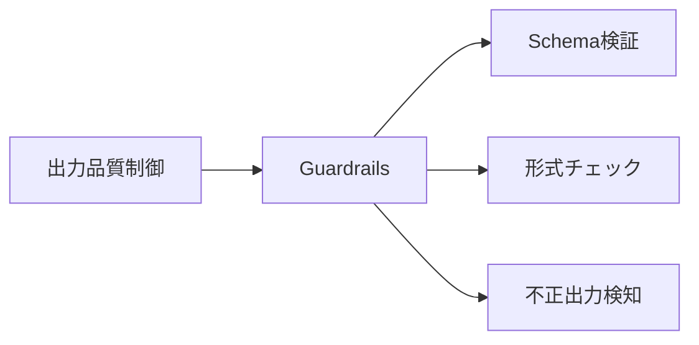
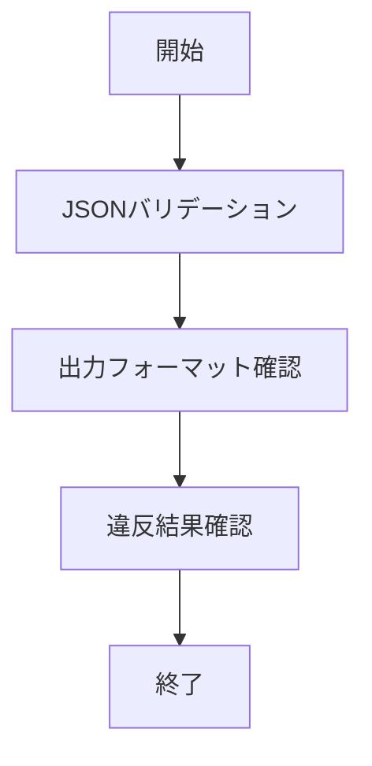

# Guardrails 入門

> 📖 中級（概念・実践） | 前提: Python基礎 / LLMアプリの基本概念

---

## 1. 機能・役割（概要）
Guardrailsは、AI信頼性プラットフォームとして、LLM出力の安全性・信頼性・形式品質を高めるOSS/クラウド対応のツール群です。  
主な役割は、スキーマ検証・ルール検証・リスク検知・合成データ生成・ランタイムガードなどを通じて、AI出力の品質と運用リスクを制御することです。

## 2. この教材で身につくこと（ゴール）

- JSONスキーマ検証
- 不正出力の再生成
- 禁止語・形式違反の検知
- シナリオ自動生成・リスク評価

## 3. コンセプト
Guardrailsは「AI信頼性プラットフォーム」として、合成データ生成・エッジケース検出・出力ガード（ポリシー違反・幻覚・漏洩検知）を提供。  
**バージョン**: 0.5.0+ / OSS準拠（2026-05時点）  
**公式ドキュメント**: https://docs.guardrailsai.com/

## 4. 仕組み（全体の流れ）
- スキーマ・ルール・ポリシーを定義し、AI出力を自動検証
- 合成データやシナリオ生成でリスク検知・評価
- ランタイムガードで本番出力を制御

### 詳細手順
1. 目的と入力を定義し、対象データや利用モデルを準備
2. コア処理（検証・再生成・リスク評価）を実行
3. 実行結果を保存・表示し、次工程に渡せる形式へ整形
4. パラメータ調整で挙動差分を比較し、品質を確認
5. 運用を想定して再実行手順と確認ポイントを定着

## 5. 位置づけ（図解）


## 6. 事前準備

- Python環境
- 必要パッケージ（guardrails-ai, python-dotenv, pydantic）

### requirements.txt
```txt
guardrails-ai==0.5.1
python-dotenv==1.0.0
pydantic==2.7.1
```

## 7. 最小セットアップ

```bash
python -m venv .venv
source .venv/bin/activate  # Windowsは .venv\Scripts\activate
pip install -r requirements.txt
```

## 8. 実行フロー



## 9. 検証

- コマンドがエラーなく完了する
- 想定した出力（画面表示・ファイル生成・回答）を確認できる
- 変更した設定に応じて結果差分を説明できる

## 10. 主要ファイルの説明

### 01_basic-validation.py
Guardrailsによる基本的なJSONスキーマ検証例。
```python
"""Guardrails basic JSON validation demo."""
from pydantic import BaseModel, Field

class StockAdvice(BaseModel):
	symbol: str = Field(min_length=1)
	recommendation: str = Field(pattern="^(buy|hold|sell)$")
	reason: str = Field(min_length=5)

## 演習課題
	parsed = StockAdvice.model_validate(payload)
	print("Validated:", parsed.model_dump())


	good = {
		"symbol": "7203",
		"recommendation": "hold",
		"reason": "業績は堅調だが短期では材料不足",
	}
	bad = {
		"symbol": "",
		"recommendation": "strong-buy",
		"reason": "短い",
	}
	validate_payload(good)
	try:
		validate_payload(bad)
	except Exception as exc:
		print("Validation error:", exc)

if __name__ == "__main__":
	main()
```

### 02_output-format-check.py
出力フォーマット（JSON構造）チェック例。
```python
"""Simple output format check for LLM text."""
import json

1. ``Guardrails 入門`` を使う想定ユースケースを1つ定義し、入力・出力の例を記録してください。
	try:
		obj = json.loads(text)
		required = {"symbol", "recommendation", "reason"}
		return required.issubset(set(obj.keys()))
	except Exception:
		return False

2. 最小構成で動かし、デフォルトから設定を1つ変えて挙動の差分を確認してください。
	ok = '{"symbol":"AAPL","recommendation":"buy","reason":"成長率が高い"}'
	ng = "AAPL is good"
	print("ok result:", check_json_output(ok))
	print("ng result:", check_json_output(ng))

if __name__ == "__main__":
	main()
```
3. ``Guardrails 入門`` を使わない場合の代替手段と比較し、選ぶ基準をまとめてください。


### 解答の目安

1. まず課題の目的を一文で明確化し、入力・出力を対応づけて記述します。
   確認ポイント: 何を変えて何を確認する課題かを第三者が読んで理解できること。
2. 最小構成で一度実行し、設定や条件を1つ変更して差分を比較します。
   確認ポイント: 変更前後の挙動差を具体的に説明できること。
3. 適用条件と代替手段を整理し、選択基準を短くまとめます。
   確認ポイント: なぜその手段を選ぶかを根拠付きで示せること。

## 理解度チェック

1. ``Guardrails 入門`` の主な役割を1文で説明してください。
2. ``Guardrails 入門`` を導入する際の最大のメリットと注意点は何ですか？
3. ``Guardrails 入門`` が向かないユースケースとして、どのようなケースが考えられますか？


### 解説の要点

1. 主な役割は、その技術がどの工程を担い、何を改善するかで説明します。
2. メリットは再現性・拡張性・運用性の観点で整理し、注意点は導入コストや複雑性として示します。
3. 使い分けは要件、実装コスト、運用体制の3観点で判断します。
---

[← 前へ](05-evaluation/03-langfuse.md) | [次へ →](06-multimodal/00-README.md)


