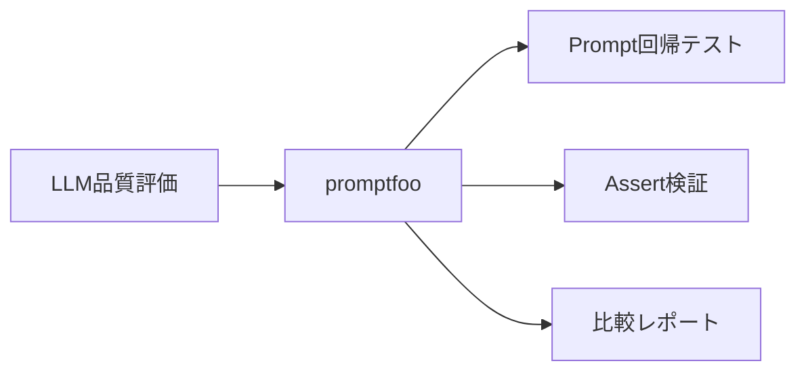
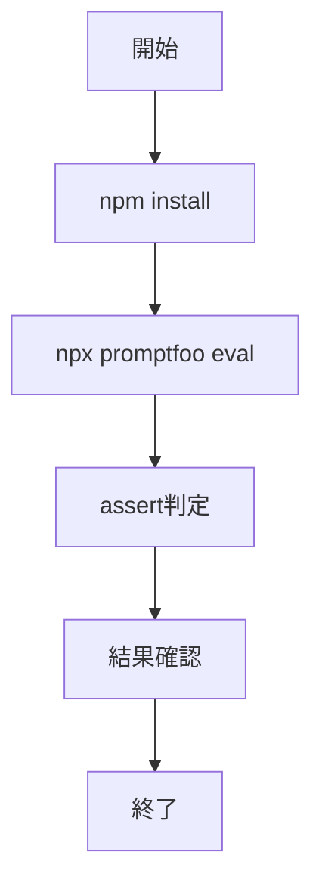

# promptfoo 入門

> 📖 中級（概念・実践） | 前提: Python基礎 / LLMアプリの基本概念

## この教材で身につくこと

- 複数プロンプトの一括評価
- assertによる品質判定
- 回帰テストとしての運用

## 概要

promptfoo は、プロンプトとモデル出力を定量比較する CLI です。
変更前後の品質差分を検知できるため、継続改善に向いています。

## 位置づけ（Mermaid）



## 実行フロー（Mermaid）



## 最小セットアップ

```bash
cd 01_promptfoo-samples
npm install
npx promptfoo eval -c 00_promptfooconfig.yaml
```

## 参考サンプル

- 設定ファイル: `01_promptfoo-samples/00_promptfooconfig.yaml`
- 実行スクリプト: `01_promptfoo-samples/00_package.json`


## 実ソースコード（言語別に記載）

### YAML: 01_promptfoo-samples/00_promptfooconfig.yaml

- 役割: 評価対象プロンプト・テストケース・assert定義
- 入力: `tests.vars.question`
- 出力: 評価結果（CLI実行時）

```yaml
description: Beginner prompt regression test
providers:
  - id: openai:gpt-3.5-turbo
prompts:
  - "あなたは投資学習アシスタントです。{{question}} を初心者向けに3行で説明してください。"
  - "{{question}} を中学生にもわかる言葉で2行で説明してください。"
tests:
  - vars:
      question: "RAG"
    assert:
      - type: contains
        value: "検索"
  - vars:
      question: "分散投資"
    assert:
      - type: llm-rubric
        value: "初心者向けで、専門用語に短い補足がある"
```

### JSON: 01_promptfoo-samples/00_package.json

- 役割: promptfoo実行用の npm スクリプト定義
- 入力: なし
- 出力: `npm run eval` で評価実行

```json
{
  "name": "promptfoo-samples",
  "private": true,
  "version": "1.0.0",
  "scripts": {
    "eval": "promptfoo eval -c 00_promptfooconfig.yaml"
  },
  "devDependencies": {
    "promptfoo": "^0.95.0"
  }
}
```

## 演習課題

1. 比較したいプロンプトを2つ作り、どの観点で優劣を判定するか決めてください。
2. assertを1つ追加し、評価結果がどう変わるか確認してください。
3. この評価をPR前チェックに組み込む場合の手順を書き出してください。


### 解答の目安

1. まず課題の目的を一文で明確化し、入力・出力を対応づけて記述します。
   確認ポイント: 何を変えて何を確認する課題かを第三者が読んで理解できること。
2. 最小構成で一度実行し、設定や条件を1つ変更して差分を比較します。
   確認ポイント: 変更前後の挙動差を具体的に説明できること。
3. 適用条件と代替手段を整理し、選択基準を短くまとめます。
   確認ポイント: なぜその手段を選ぶかを根拠付きで示せること。
## 理解度チェック

1. promptfoo の主な役割を1文で説明してください。
2. assert を使う利点は何ですか？
3. 手動レビューのみと比べたときの限界は何ですか？


### 解説の要点

1. 主な役割は、その技術がどの工程を担い、何を改善するかで説明します。
2. メリットは再現性・拡張性・運用性の観点で整理し、注意点は導入コストや複雑性として示します。
3. 使い分けは要件、実装コスト、運用体制の3観点で判断します。
---

[← 前へ](05_evaluation/00_README.md) | [次へ →](05_evaluation/02_ragas.md)

