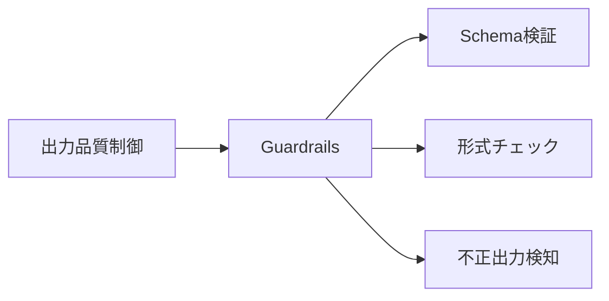
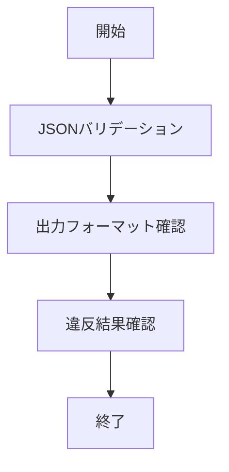

# Guardrails 入門

> 📖 中級（概念・実践） | 前提: Python基礎 / LLMアプリの基本概念

## この教材で身につくこと

- JSONスキーマ検証
- 不正出力の再生成
- 禁止語・形式違反の検知

## コンセプト
Guardrails は LLM 出力をスキーマやルールで検証し、安全性と形式品質を高めるライブラリです。

## 仕組み

1. 目的と入力を定義し、対象データや利用モデルを準備します。
2. コア処理（検索・推論・生成・検証のいずれか）を実行します。
3. 実行結果を保存または表示し、次工程に渡せる形式へ整えます。
4. パラメータを調整して挙動差分を比較し、品質を確認します。
5. 運用を想定して再実行手順と確認ポイントを定着させます。
## 位置づけ



## 実行フロー



## サンプル

### 実行例

```bash
# この教材の最小構成を順に実行
# 具体的なコマンドは「最小セットアップ」または「実行フロー」を参照
```

### 検証

- コマンドがエラーなく完了する
- 想定した出力（画面表示・ファイル生成・回答）を確認できる
- 変更した設定に応じて結果差分を説明できる
## 実ソースコード（言語別に記載）
### 00_requirements.txt

```txt
guardrails-ai==0.5.1
python-dotenv==1.0.0
pydantic==2.7.1
```

### 01_basic-validation.py

```python
"""Guardrails basic JSON validation demo."""

from pydantic import BaseModel, Field


class StockAdvice(BaseModel):
	symbol: str = Field(min_length=1)
	recommendation: str = Field(pattern="^(buy|hold|sell)$")
	reason: str = Field(min_length=5)


def validate_payload(payload: dict) -> None:
	parsed = StockAdvice.model_validate(payload)
	print("Validated:", parsed.model_dump())


def main() -> None:
	good = {
		"symbol": "7203",
		"recommendation": "hold",
		"reason": "業績は堅調だが短期では材料不足",
	}
	bad = {
		"symbol": "",
		"recommendation": "strong-buy",
		"reason": "短い",
	}

	validate_payload(good)

	try:
		validate_payload(bad)
	except Exception as exc:
		print("Validation error:", exc)


if __name__ == "__main__":
	main()
```

### 02_output-format-check.py

```python
"""Simple output format check for LLM text."""

import json


def check_json_output(text: str) -> bool:
	try:
		obj = json.loads(text)
		required = {"symbol", "recommendation", "reason"}
		return required.issubset(set(obj.keys()))
	except Exception:
		return False


def main() -> None:
	ok = '{"symbol":"AAPL","recommendation":"buy","reason":"成長率が高い"}'
	ng = "AAPL is good"

	print("ok result:", check_json_output(ok))
	print("ng result:", check_json_output(ng))


if __name__ == "__main__":
	main()
```

## 演習課題

1. ``Guardrails 入門`` を使う想定ユースケースを1つ定義し、入力・出力の例を記録してください。
2. 最小構成で動かし、デフォルトから設定を1つ変えて挙動の差分を確認してください。
3. ``Guardrails 入門`` を使わない場合の代替手段と比較し、選ぶ基準をまとめてください。


### 解答の目安

1. まず課題の目的を一文で明確化し、入力・出力を対応づけて記述します。
   確認ポイント: 何を変えて何を確認する課題かを第三者が読んで理解できること。
2. 最小構成で一度実行し、設定や条件を1つ変更して差分を比較します。
   確認ポイント: 変更前後の挙動差を具体的に説明できること。
3. 適用条件と代替手段を整理し、選択基準を短くまとめます。
   確認ポイント: なぜその手段を選ぶかを根拠付きで示せること。
## 理解度チェック

1. ``Guardrails 入門`` の主な役割を1文で説明してください。
2. ``Guardrails 入門`` を導入する際の最大のメリットと注意点は何ですか？
3. ``Guardrails 入門`` が向かないユースケースとして、どのようなケースが考えられますか？


### 解説の要点

1. 主な役割は、その技術がどの工程を担い、何を改善するかで説明します。
2. メリットは再現性・拡張性・運用性の観点で整理し、注意点は導入コストや複雑性として示します。
3. 使い分けは要件、実装コスト、運用体制の3観点で判断します。
---

[← 前へ](05_evaluation/03_langfuse.md) | [次へ →](06_multimodal/00_README.md)


