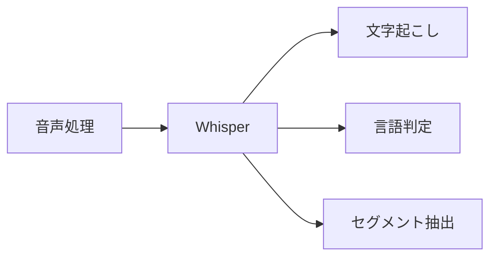
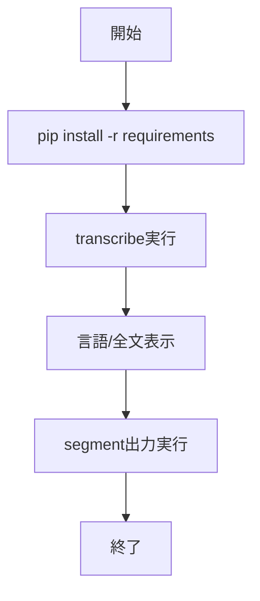

# Whisper - 音声ファイルの文字起こしOSSモデル

> 📖 中級（概念・実践） | 前提: Python基礎 / LLMアプリの基本概念

## この教材で身につくこと

- 音声ファイルをテキストへ文字起こしできる
- 言語を自動推定できる
- セグメントごとの時刻情報を取得できる
- Whisper のモデルサイズを切り替えて精度とコストを比較できる
- 会議録・動画字幕などの実務ユースケースへ適用できる

## 概要

**Whisper** は音声をテキストへ変換する OSS モデルです。会議録、動画字幕、音声ログ解析に使えます。

**バージョン**: 2026-05時点 / OSS準拠  
**公式ドキュメント**: https://github.com/openai/whisper

## 位置づけ



Whisper は音声入力を受け取り、テキスト・言語・タイムスタンプを出力します。会議録自動生成や字幕付与パイプラインの入力段として使います。

## 実行フロー



この教材では、音声ファイルを入力として全文文字起こしとセグメント出力を順に確認します。

## 最小セットアップ

### 必須スキル

- Python 基本（3.10以上推奨）
- 仮想環境の操作

### 環境

- Python 3.10+
- pip
- 仮想環境（venv推奨）
- 音声ファイル（.wav / .mp3）

### インストール

```bash
cd 01_whisper-python
pip install -r 00_requirements.txt
```

### 実行

```bash
python 01_transcribe-file.py sample.wav
```

## 実ソースコード

### 00_requirements.txt

```txt
openai-whisper==20231117
torch==2.2.2
```

### 01_transcribe-file.py

```python
"""Whisper file transcription demo.
Usage: python 01_transcribe-file.py sample.wav
"""

import argparse
import whisper


def main() -> None:
	parser = argparse.ArgumentParser()
	parser.add_argument("audio_path", help="Path to audio file")
	parser.add_argument("--model", default="base", help="Whisper model size")
	args = parser.parse_args()

	model = whisper.load_model(args.model)
	result = model.transcribe(args.audio_path, fp16=False)

	print("Language:", result.get("language"))
	print("\nText:")
	print(result.get("text", ""))


if __name__ == "__main__":
	main()
```

### 02_segments.py

```python
"""Whisper segment-level output demo.
Usage: python 02_segments.py sample.wav
"""

import argparse
import whisper


def main() -> None:
	parser = argparse.ArgumentParser()
	parser.add_argument("audio_path")
	args = parser.parse_args()

	model = whisper.load_model("base")
	result = model.transcribe(args.audio_path, fp16=False)

	for seg in result.get("segments", []):
		start = seg.get("start", 0.0)
		end = seg.get("end", 0.0)
		text = seg.get("text", "").strip()
		print(f"[{start:6.2f}-{end:6.2f}] {text}")


if __name__ == "__main__":
	main()
```

## 演習課題

1. Whisper を使う想定ユースケースを1つ定義し、入力・出力の例を記録してください。
2. 最小構成で動かし、モデルサイズを `base` から `small` に変えて精度の差分を確認してください。
3. Whisper を使わない場合の代替手段と比較し、選ぶ基準をまとめてください。

### 解答の目安

1. まず課題の目的を一文で明確化し、入力・出力を対応づけて記述します。
   確認ポイント: 何を変えて何を確認する課題かを第三者が読んで理解できること。
2. 最小構成で一度実行し、設定や条件を1つ変更して差分を比較します。
   確認ポイント: 変更前後の挙動差を具体的に説明できること。
3. 適用条件と代替手段を整理し、選択基準を短くまとめます。
   確認ポイント: なぜその手段を選ぶかを根拠付きで示せること。

## 理解度チェック

1. Whisper の主な役割を1文で説明してください。
2. Whisper を導入する際の最大のメリットと注意点は何ですか？
3. Whisper が向かないユースケースとして、どのようなケースが考えられますか？

### 解説の要点

1. 主な役割は、その技術がどの工程を担い、何を改善するかで説明します。
2. メリットは再現性・拡張性・運用性の観点で整理し、注意点は導入コストや複雑性として示します。
3. 使い分けは要件、実装コスト、運用体制の3観点で判断します。

## 参考リンク

- [Whisper GitHub リポジトリ](https://github.com/openai/whisper)
- [Whisper モデルサイズ比較](https://github.com/openai/whisper#available-models-and-languages)

---

[← 前へ](00-README.md) | [次へ →](02-piper.md)
