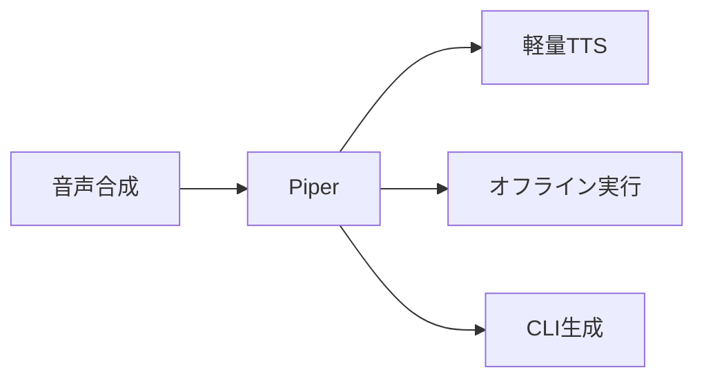
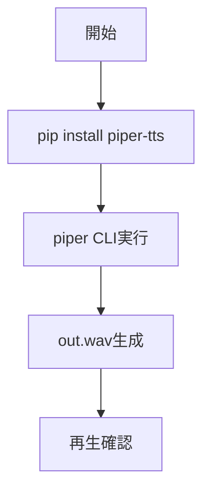

# Piper - 軽量ローカルTTSエンジン

> 📖 中級（概念・実践） | 前提: Python基礎 / LLMアプリの基本概念

## この教材で身につくこと

- 日本語・英語などのテキストを音声ファイルへ変換できる
- 低遅延なローカル音声合成を実行できる
- オフライン環境で音声生成パイプラインを構築できる
- CLIで音声ファイルを生成し再生確認できる
- Piper と他のTTSエンジンの使い分け基準を説明できる

## 概要

**Piper** は軽量なTTS（Text-to-Speech）エンジンです。ローカルで高速に音声合成できます。

**バージョン**: 2026-05時点 / OSS準拠  
**公式ドキュメント**: https://github.com/rhasspy/piper

## 位置づけ

この例では、Piper - 軽量ローカルTTSエンジン の基本的な利用手順を示します。サンプルコードの意図と、実行時に何が起こるのかを確認しながら読み進めると理解しやすくなります。



Piper はテキスト入力を受け取り、音声ファイル（.wav）を出力します。クラウドAPI不要でローカル完結するため、プライバシー要件がある環境や低レイテンシが必要な用途に向いています。

## 実行フロー



この教材では、CLIを使ってテキストから音声ファイルを生成し、再生確認するまでの流れを確認します。

## 最小セットアップ

### 必須スキル

- Python 基本（3.10以上推奨）
- 仮想環境の操作
- 音声出力環境

### 環境

- Python 3.10+
- pip
- 仮想環境（venv推奨）

### インストール

```bash
pip install piper-tts
```

### 音声モデルの取得

Piper は言語別の ONNX モデルを使用します。日本語モデル（`ja_JP-kokoro-medium`）を事前にダウンロードしてください。

### 実行

```bash
piper --model ja_JP-kokoro-medium.onnx --output_file out.wav --text "こんにちは。Piperのテストです。"
```

OS標準プレイヤーで `out.wav` を再生して確認します。

## 実ソースコード

### 00_setup-guide.md

```text
# Piper セットアップガイド

## 前提条件
- Python 3.10+
- 音声出力環境

## インストール（例）
pip install piper-tts

## 音声合成（CLI例）
piper --model ja_JP-kokoro-medium.onnx --output_file out.wav --text "こんにちは。Piperのテストです。"

## 再生
OS標準プレイヤーで out.wav を再生します。
```

## 演習課題

1. Piper を使う想定ユースケースを1つ定義し、入力テキストと出力音声ファイルの仕様を記録してください。
2. 最小構成で動かし、音声モデルを変えて音質の差分を確認してください。
3. Piper を使わない場合の代替手段（クラウドTTSなど）と比較し、選ぶ基準をまとめてください。

### 解答の目安

1. まず課題の目的を一文で明確化し、入力・出力を対応づけて記述します。
   確認ポイント: 何を変えて何を確認する課題かを第三者が読んで理解できること。
2. 最小構成で一度実行し、設定や条件を1つ変更して差分を比較します。
   確認ポイント: 変更前後の挙動差を具体的に説明できること。
3. 適用条件と代替手段を整理し、選択基準を短くまとめます。
   確認ポイント: なぜその手段を選ぶかを根拠付きで示せること。

## 理解度チェック

1. Piper の主な役割を1文で説明してください。
2. Piper を導入する際の最大のメリットと注意点は何ですか？
3. Piper が向かないユースケースとして、どのようなケースが考えられますか？

### 解説の要点

1. 主な役割は、その技術がどの工程を担い、何を改善するかで説明します。
2. メリットは再現性・拡張性・運用性の観点で整理し、注意点は導入コストや複雑性として示します。
3. 使い分けは要件、実装コスト、運用体制の3観点で判断します。

## 参考リンク

- [Piper GitHub リポジトリ](https://github.com/rhasspy/piper)
- [Piper 音声モデル一覧](https://github.com/rhasspy/piper/blob/master/VOICES.md)

---

[← 前へ](01-whisper.md) | [次へ →](03-comfyui.md)
