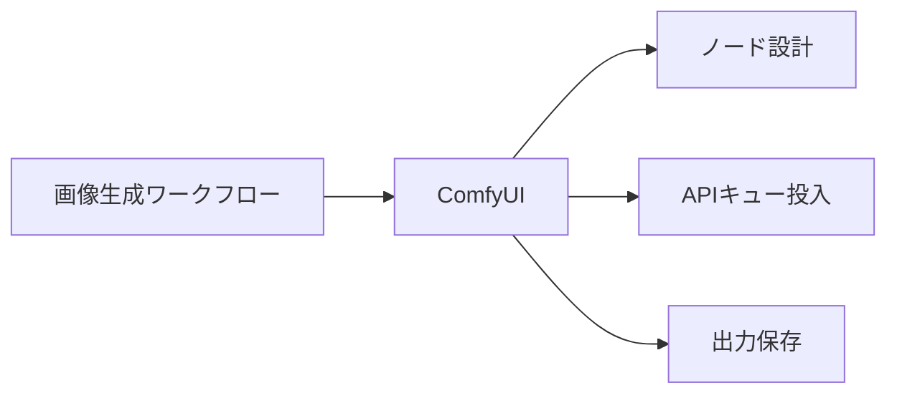
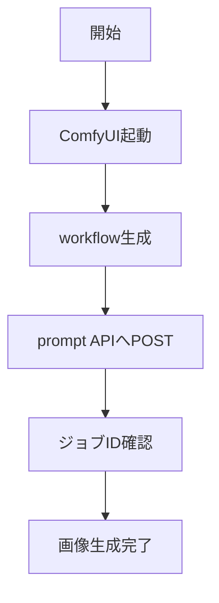

# ComfyUI - ノードベースの画像生成ワークフローツール

> 📖 中級（概念・実践） | 前提: Python基礎 / LLMアプリの基本概念

## この教材で身につくこと

- ノード接続による画像生成フローを作成できる
- ControlNet や LoRA と連携できる
- API経由でワークフローを自動実行できる
- ComfyUI の prompt API へ JSON をPOSTして画像を取得できる
- 他の画像生成ツールとの使い分け基準を説明できる

## 概要

**ComfyUI** はノードベースで Stable Diffusion ワークフローを構築できるツールです。生成工程を可視化しながら細かく制御できます。

**バージョン**: 最新版 / OSS準拠（2026-05時点）  
**公式ドキュメント**: https://github.com/comfyanonymous/ComfyUI

## 位置づけ

この例では、ComfyUI - ノードベースの画像生成ワークフローツール の基本的な利用手順を示します。サンプルコードの意図と、実行時に何が起こるのかを確認しながら読み進めると理解しやすくなります。



ComfyUI はノードグラフでワークフローを定義し、Web UI または REST API 経由で画像生成を実行します。細かい工程制御が必要なケースや、自動化パイプラインへの組み込みに向いています。

## 実行フロー



この教材では、ComfyUI を起動してから Python スクリプトで prompt API へワークフローをPOSTし、画像生成完了を確認します。

## 最小セットアップ

### 必須スキル

- Python 基本（3.10以上推奨）
- Git の基本操作

### 環境

- Python 3.10+
- pip
- GPU推奨（CPUでも動作可能）

### インストール

```bash
git clone https://github.com/comfyanonymous/ComfyUI.git
cd ComfyUI
pip install -r requirements.txt
```

### 起動

```bash
python main.py
```

ブラウザで http://127.0.0.1:8188 にアクセスします。

### Python クライアント用依存

```bash
pip install requests
```

## 実ソースコード

### 03_comfyui-python/00_requirements.txt

```txt
requests==2.32.3
```

### 03_comfyui-python/01_queue-prompt.py

```python
"""ComfyUI API prompt queue sample.

Run ComfyUI first, then execute:
python 01_queue-prompt.py
"""

import json
import uuid
import requests

COMFYUI_URL = "http://127.0.0.1:8188"


def build_minimal_workflow(prompt: str) -> dict:
	return {
		"3": {
			"class_type": "KSampler",
			"inputs": {
				"seed": 1,
				"steps": 20,
				"cfg": 8,
				"sampler_name": "euler",
				"scheduler": "normal",
				"denoise": 1,
				"model": ["4", 0],
				"positive": ["6", 0],
				"negative": ["7", 0],
				"latent_image": ["5", 0],
			},
		},
		"4": {
			"class_type": "CheckpointLoaderSimple",
			"inputs": {"ckpt_name": "v1-5-pruned-emaonly.ckpt"},
		},
		"5": {
			"class_type": "EmptyLatentImage",
			"inputs": {"width": 512, "height": 512, "batch_size": 1},
		},
		"6": {"class_type": "CLIPTextEncode", "inputs": {"text": prompt, "clip": ["4", 1]}},
		"7": {
			"class_type": "CLIPTextEncode",
			"inputs": {"text": "low quality", "clip": ["4", 1]},
		},
		"8": {"class_type": "VAEDecode", "inputs": {"samples": ["3", 0], "vae": ["4", 2]}},
		"9": {
			"class_type": "SaveImage",
			"inputs": {"filename_prefix": "tutorial", "images": ["8", 0]},
		},
	}


def main() -> None:
	workflow = build_minimal_workflow("a futuristic city at sunset")
	payload = {"prompt": workflow, "client_id": str(uuid.uuid4())}

	res = requests.post(f"{COMFYUI_URL}/prompt", json=payload, timeout=30)
	res.raise_for_status()

	print("Queued prompt:")
	print(json.dumps(res.json(), indent=2))


if __name__ == "__main__":
	main()
```

## 演習課題

1. ComfyUI を使う想定ユースケースを1つ定義し、入力プロンプトと出力画像の仕様を記録してください。
2. 最小構成で動かし、`steps` や `cfg` を変えて画像品質の差分を確認してください。
3. ComfyUI を使わない場合の代替手段（AUTOMATIC1111など）と比較し、選ぶ基準をまとめてください。

### 解答の目安

1. まず課題の目的を一文で明確化し、入力・出力を対応づけて記述します。
   確認ポイント: 何を変えて何を確認する課題かを第三者が読んで理解できること。
2. 最小構成で一度実行し、設定や条件を1つ変更して差分を比較します。
   確認ポイント: 変更前後の挙動差を具体的に説明できること。
3. 適用条件と代替手段を整理し、選択基準を短くまとめます。
   確認ポイント: なぜその手段を選ぶかを根拠付きで示せること。

## 理解度チェック

1. ComfyUI の主な役割を1文で説明してください。
2. ComfyUI を導入する際の最大のメリットと注意点は何ですか？
3. ComfyUI が向かないユースケースとして、どのようなケースが考えられますか？

### 解説の要点

1. 主な役割は、その技術がどの工程を担い、何を改善するかで説明します。
2. メリットは再現性・拡張性・運用性の観点で整理し、注意点は導入コストや複雑性として示します。
3. 使い分けは要件、実装コスト、運用体制の3観点で判断します。

## 参考リンク

- [ComfyUI GitHub リポジトリ](https://github.com/comfyanonymous/ComfyUI)
- [ComfyUI API ドキュメント](https://github.com/comfyanonymous/ComfyUI/blob/master/server.py)

---

[← 前へ](02-piper.md) | [次へ →](04-automatic1111.md)
