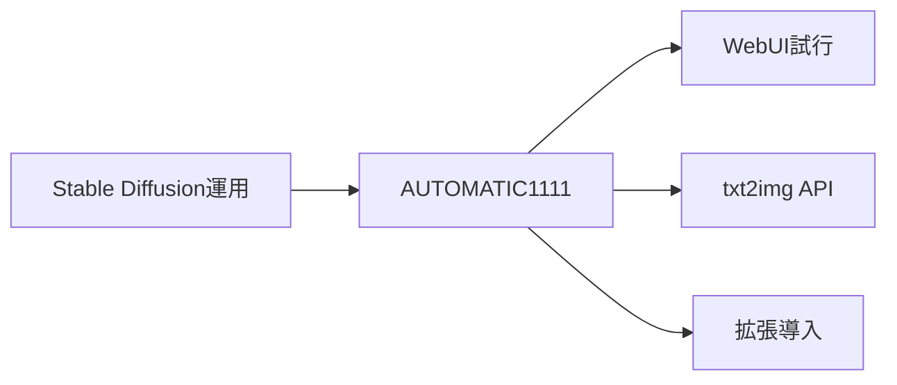
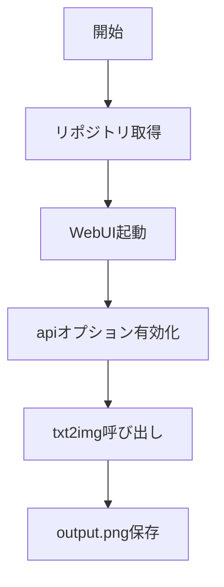

# AUTOMATIC1111 - Stable Diffusion Web UIの定番実装

> 📖 中級（概念・実践） | 前提: Python基礎 / LLMアプリの基本概念

## この教材で身につくこと

- txt2img / img2img で画像生成を実行できる
- 拡張機能を導入してWeb UIをカスタマイズできる
- REST API 経由で画像生成を自動化できる
- プロンプトとパラメータを調整して出力品質を改善できる
- AUTOMATIC1111 と他の画像生成UIの使い分け基準を説明できる

## 概要

**AUTOMATIC1111** は Stable Diffusion Web UI の定番実装です。UIでの試行錯誤と API 自動化の両方に向いています。

**バージョン**: 最新版 / OSS準拠（2026-05時点）  
**公式ドキュメント**: https://github.com/AUTOMATIC1111/stable-diffusion-webui

## 位置づけ

この例では、AUTOMATIC1111 - Stable Diffusion Web UIの定番実装 の基本的な利用手順を示します。サンプルコードの意図と、実行時に何が起こるのかを確認しながら読み進めると理解しやすくなります。



AUTOMATIC1111 は Stable Diffusion のフロントエンドとして、Web UI による手動操作と REST API による自動化の両方を提供します。豊富な拡張機能エコシステムを持ち、試行錯誤から本番自動化まで対応できます。

## 実行フロー



この教材では、AUTOMATIC1111 を `--api` オプションで起動し、Python スクリプトから txt2img API を呼び出して画像を保存します。

## 最小セットアップ

### 必須スキル

- Python 基本（3.10以上推奨）
- Git の基本操作

### 環境

- Python 3.10+
- Git
- GPU推奨（VRAM 4GB以上）

### インストール

```bash
git clone https://github.com/AUTOMATIC1111/stable-diffusion-webui.git
cd stable-diffusion-webui
```

### 起動

```bash
# Linux / macOS
./webui.sh --api

# Windows
webui-user.bat
```

Windows の場合は `webui-user.bat` 内の `COMMANDLINE_ARGS` に `--api` を追加します。

ブラウザで http://127.0.0.1:7860 にアクセスします。

### Python クライアント用依存

```bash
pip install requests
```

## 実ソースコード

### 04_automatic1111-python/00_requirements.txt

```txt
requests==2.32.3
```

### 04_automatic1111-python/01_txt2img.py

```python
"""AUTOMATIC1111 txt2img API sample.

Start webui with --api and run:
python 01_txt2img.py
"""

import base64
from pathlib import Path
import requests

WEBUI_URL = "http://127.0.0.1:7860"


def main() -> None:
	payload = {
		"prompt": "a watercolor painting of Mt. Fuji",
		"negative_prompt": "low quality, blurry",
		"steps": 20,
		"width": 512,
		"height": 512,
	}

	res = requests.post(f"{WEBUI_URL}/sdapi/v1/txt2img", json=payload, timeout=120)
	res.raise_for_status()

	data = res.json()
	images = data.get("images", [])
	if not images:
		raise RuntimeError(
			"No images returned"
		)

	img_bytes = base64.b64decode(images[0])
	out = Path("output.png")
	out.write_bytes(img_bytes)
	print(f"Saved: {out.resolve()}")


if __name__ == "__main__":
	main()
```

## 演習課題

1. AUTOMATIC1111 を使う想定ユースケースを1つ定義し、プロンプトと出力画像の仕様を記録してください。
2. 最小構成で動かし、`steps` または `negative_prompt` を変えて画像品質の差分を確認してください。
3. AUTOMATIC1111 を使わない場合の代替手段（ComfyUIなど）と比較し、選ぶ基準をまとめてください。

### 解答の目安

1. まず課題の目的を一文で明確化し、入力・出力を対応づけて記述します。
   確認ポイント: 何を変えて何を確認する課題かを第三者が読んで理解できること。
2. 最小構成で一度実行し、設定や条件を1つ変更して差分を比較します。
   確認ポイント: 変更前後の挙動差を具体的に説明できること。
3. 適用条件と代替手段を整理し、選択基準を短くまとめます。
   確認ポイント: なぜその手段を選ぶかを根拠付きで示せること。

## 理解度チェック

1. AUTOMATIC1111 の主な役割を1文で説明してください。
2. AUTOMATIC1111 を導入する際の最大のメリットと注意点は何ですか？
3. AUTOMATIC1111 が向かないユースケースとして、どのようなケースが考えられますか？

### 解説の要点

1. 主な役割は、その技術がどの工程を担い、何を改善するかで説明します。
2. メリットは再現性・拡張性・運用性の観点で整理し、注意点は導入コストや複雑性として示します。
3. 使い分けは要件、実装コスト、運用体制の3観点で判断します。

## 参考リンク

- [AUTOMATIC1111 GitHub リポジトリ](https://github.com/AUTOMATIC1111/stable-diffusion-webui)
- [AUTOMATIC1111 API ドキュメント](https://github.com/AUTOMATIC1111/stable-diffusion-webui/wiki/API)

---

[← 前へ](03-comfyui.md) | [次へ →](05-invokeai.md)
