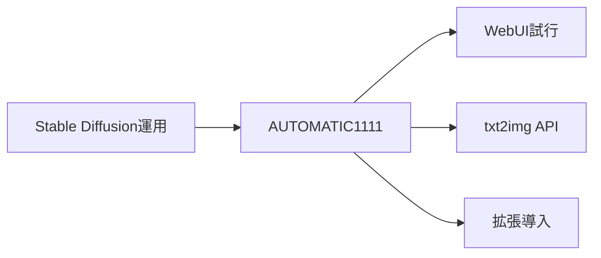
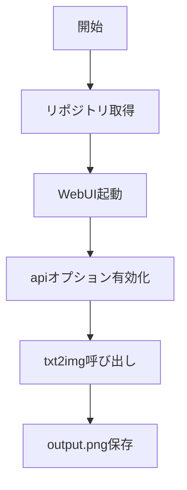

# AUTOMATIC1111 入門

> 📖 中級（概念・実践） | 前提: Python基礎 / LLMアプリの基本概念

## この教材で身につくこと

- txt2img / img2img
- 拡張機能導入
- REST API 呼び出し

## コンセプト
AUTOMATIC1111 は Stable Diffusion Web UI の定番実装です。UIでの試行錯誤と API 自動化の両方に向いています。
**バージョン**: 最新版 / OSS準拠（2026-05時点）  
**公式ドキュメント**: https://github.com/AUTOMATIC1111/stable-diffusion-webui
## 仕組み

1. 目的と入力を定義し、対象データや利用モデルを準備します。
2. コア処理（検索・推論・生成・検証のいずれか）を実行します。
3. 実行結果を保存または表示し、次工程に渡せる形式へ整えます。
4. パラメータを調整して挙動差分を比較し、品質を確認します。
5. 運用を想定して再実行手順と確認ポイントを定着させます。
## 位置づけ



## 実行フロー



## サンプル

### 実行例

```bash
# この教材の最小構成を順に実行
# 具体的なコマンドは「最小セットアップ」または「実行フロー」を参照
```

### 検証

- コマンドがエラーなく完了する
- 想定した出力（画面表示・ファイル生成・回答）を確認できる
- 変更した設定に応じて結果差分を説明できる

## 実ソースコード（言語別に記載）
### セットアップ手順（最小）

```text
# AUTOMATIC1111 セットアップガイド

## 概要
git clone https://github.com/AUTOMATIC1111/stable-diffusion-webui.git
cd stable-diffusion-webui

## 詳細
./webui.sh

Windows は webui-user.bat を使用します。

## 前提条件
起動オプションに --api を追加します。
```

### 04_automatic1111-python/00_requirements.txt

```txt
requests==2.32.3
```

### 04_automatic1111-python/01_txt2img.py

```python
"""AUTOMATIC1111 txt2img API sample.

Start webui with --api and run:
python 01_txt2img.py
"""

import base64
from pathlib import Path
import requests

WEBUI_URL = "http://127.0.0.1:7860"


def main() -> None:
	payload = {
		"prompt": "a watercolor painting of Mt. Fuji",
		"negative_prompt": "low quality, blurry",
		"steps": 20,
		"width": 512,
		"height": 512,
	}

	res = requests.post(f"{WEBUI_URL}/sdapi/v1/txt2img", json=payload, timeout=120)
	res.raise_for_status()

	data = res.json()
	images = data.get("images", [])
	if not images:
		raise RuntimeError("No images returned")

	img_bytes = base64.b64decode(images[0])
	out = Path("output.png")
	out.write_bytes(img_bytes)
	print(f"Saved: {out.resolve()}")


if __name__ == "__main__":
	main()
```

## 演習課題

1. ``AUTOMATIC1111 入門`` を使う想定ユースケースを1つ定義し、入力・出力の例を記録してください。
2. 最小構成で動かし、デフォルトから設定を1つ変えて挙動の差分を確認してください。
3. ``AUTOMATIC1111 入門`` を使わない場合の代替手段と比較し、選ぶ基準をまとめてください。


### 解答の目安

1. まず課題の目的を一文で明確化し、入力・出力を対応づけて記述します。
   確認ポイント: 何を変えて何を確認する課題かを第三者が読んで理解できること。
2. 最小構成で一度実行し、設定や条件を1つ変更して差分を比較します。
   確認ポイント: 変更前後の挙動差を具体的に説明できること。
3. 適用条件と代替手段を整理し、選択基準を短くまとめます。
   確認ポイント: なぜその手段を選ぶかを根拠付きで示せること。

## 理解度チェック

1. ``AUTOMATIC1111 入門`` の主な役割を1文で説明してください。
2. ``AUTOMATIC1111 入門`` を導入する際の最大のメリットと注意点は何ですか？
3. ``AUTOMATIC1111 入門`` が向かないユースケースとして、どのようなケースが考えられますか？


### 解説の要点

1. 主な役割は、その技術がどの工程を担い、何を改善するかで説明します。
2. メリットは再現性・拡張性・運用性の観点で整理し、注意点は導入コストや複雑性として示します。
3. 使い分けは要件、実装コスト、運用体制の3観点で判断します。
---

[← 前へ](06-multimodal/03-comfyui.md) | [次へ →](06-multimodal/05-invokeai.md)


