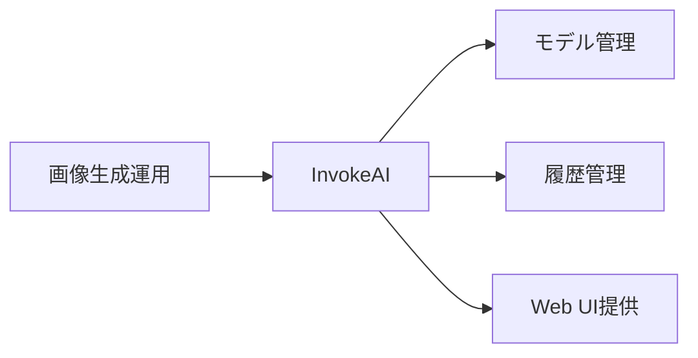
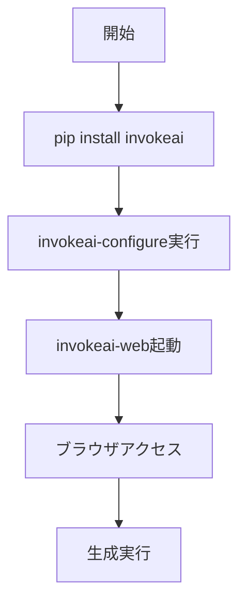

# InvokeAI - 実務向け画像生成ツール

> 📖 中級（概念・実践） | 前提: Python基礎 / LLMアプリの基本概念

## この教材で身につくこと

- InvokeAI の主な役割と適用場面を説明できる
- InvokeAI を最小構成で動かす手順を実行できる
- モデル管理・履歴管理の操作を実施できる
- Web UI 経由で画像生成から結果確認までを実行できる
- 導入時のメリットと注意点を整理できる

## 概要

**InvokeAI** は実務向け機能を備えた画像生成ツールです。モデル管理や履歴管理がしやすく、運用寄りの構成に向きます。

**バージョン**: 最新版 / OSS準拠（2026-05時点）  
**公式ドキュメント**: https://www.invokeai.org/

## 位置づけ

この例では、InvokeAI - 実務向け画像生成ツール の基本的な利用手順を示します。サンプルコードの意図と、実行時に何が起こるのかを確認しながら読み進めると理解しやすくなります。



InvokeAI はモデルのインストール・切り替えと生成履歴管理を Web UI で一元管理できる画像生成ツールです。チームでの運用や複数モデルの管理が必要なケースに向いています。

## 実行フロー



この教材では、InvokeAI をインストールして設定ウィザードを実行し、Web UI で画像生成を確認するまでの流れを確認します。

## 最小セットアップ

### 必須スキル

- Python 基本（3.10以上推奨）
- 仮想環境の操作

### 環境

- Python 3.10+
- pip
- GPU推奨（VRAM 4GB以上）

### インストール

```bash
pip install invokeai
```

### 初期設定

```bash
invokeai-configure
```

### 起動

```bash
invokeai-web
```

ブラウザで http://127.0.0.1:9090 にアクセスします。

## 実ソースコード

### セットアップ手順（最小）

```text
# InvokeAI セットアップガイド

## インストール
pip install invokeai
invokeai-configure

## 起動
invokeai-web

## アクセス
- http://127.0.0.1:9090
```

## 演習課題

1. InvokeAI を使う想定ユースケースを1つ定義し、モデル構成と出力画像の仕様を記録してください。
2. 最小構成で動かし、モデルを切り替えて画像品質の差分を確認してください。
3. InvokeAI を使わない場合の代替手段（AUTOMATIC1111など）と比較し、選ぶ基準をまとめてください。

### 解答の目安

1. まず課題の目的を一文で明確化し、入力・出力を対応づけて記述します。
   確認ポイント: 何を変えて何を確認する課題かを第三者が読んで理解できること。
2. 最小構成で一度実行し、設定や条件を1つ変更して差分を比較します。
   確認ポイント: 変更前後の挙動差を具体的に説明できること。
3. 適用条件と代替手段を整理し、選択基準を短くまとめます。
   確認ポイント: なぜその手段を選ぶかを根拠付きで示せること。

## 理解度チェック

1. InvokeAI の主な役割を1文で説明してください。
2. InvokeAI を導入する際の最大のメリットと注意点は何ですか？
3. InvokeAI が向かないユースケースとして、どのようなケースが考えられますか？

### 解説の要点

1. 主な役割は、その技術がどの工程を担い、何を改善するかで説明します。
2. メリットは再現性・拡張性・運用性の観点で整理し、注意点は導入コストや複雑性として示します。
3. 使い分けは要件、実装コスト、運用体制の3観点で判断します。

## 参考リンク

- [InvokeAI 公式サイト](https://www.invokeai.org/)
- [InvokeAI GitHub リポジトリ](https://github.com/invoke-ai/InvokeAI)

---

[← 前へ](04-automatic1111.md) | [次へ →](06-fooocus.md)
