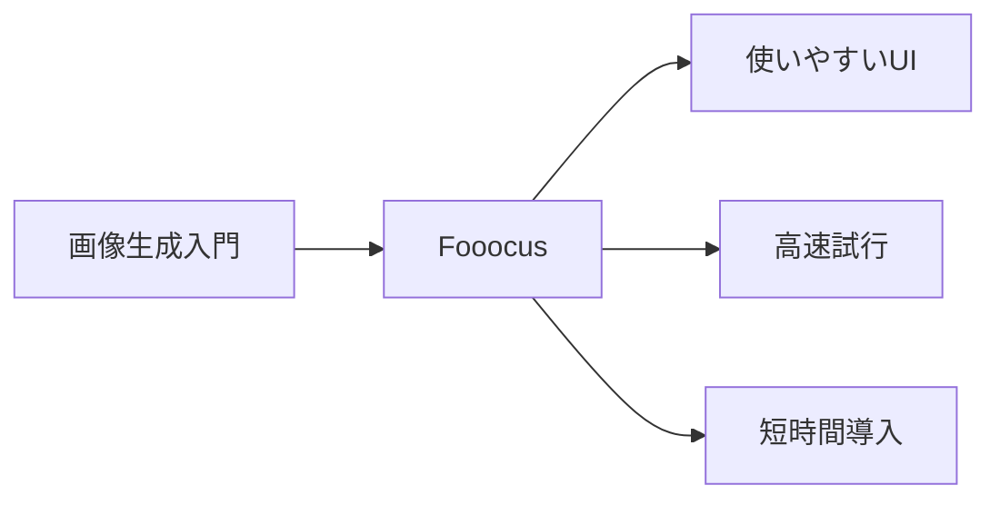
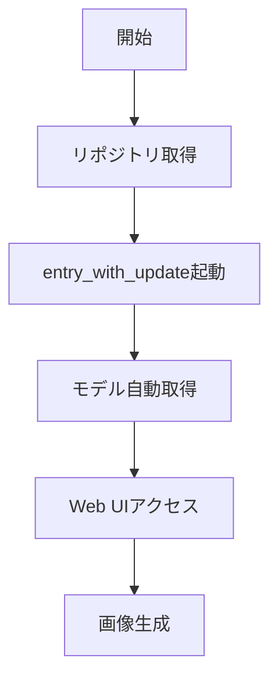

# Fooocus - シンプル操作の画像生成UI

> 📖 中級（概念・実践） | 前提: Python基礎 / LLMアプリの基本概念

## この教材で身につくこと

- Fooocus の主な役割と適用場面を説明できる
- Fooocus を最小構成で起動できる
- 短時間で品質の高い画像を生成できる
- 設定を変えて出力品質の差分を確認できる
- 導入時のメリットと注意点を整理できる

## 概要

**Fooocus** は使いやすさ重視の画像生成UIです。細かい設定に踏み込みすぎず、短時間で品質の高い画像を生成しやすいです。

**バージョン**: 最新版 / OSS準拠（2026-05時点）  
**公式ドキュメント**: https://github.com/lllyasviel/Fooocus

## 位置づけ

この例では、Fooocus - シンプル操作の画像生成UI の基本的な利用手順を示します。サンプルコードの意図と、実行時に何が起こるのかを確認しながら読み進めると理解しやすくなります。



Fooocus は複雑な設定を自動最適化し、プロンプト入力から高品質な画像生成までをシンプルに提供します。初心者や素早いプロトタイピングが必要な場面に向いています。

## 実行フロー



この教材では、Fooocus をクローンして起動し、モデルの自動ダウンロード後に Web UI で画像生成を確認します。

## 最小セットアップ

### 必須スキル

- Python 基本（3.10以上推奨）
- Git の基本操作

### 環境

- Python 3.10+
- Git
- GPU推奨（VRAM 4GB以上）
- 初回起動時に数GB のモデルが自動ダウンロードされます

### インストールと起動

```bash
git clone https://github.com/lllyasviel/Fooocus.git
cd Fooocus
python entry_with_update.py
```

初回起動時にモデルが自動ダウンロードされます。ブラウザで表示されたURLにアクセスします。

## 実ソースコード

### セットアップ手順（最小）

```text
# Fooocus セットアップガイド

## 概要
git clone https://github.com/lllyasviel/Fooocus.git
cd Fooocus

## 詳細
python entry_with_update.py

初回起動時にモデルが自動ダウンロードされます。
```

## 演習課題

1. Fooocus を使う想定ユースケースを1つ定義し、入力プロンプトと出力画像の仕様を記録してください。
2. 最小構成で動かし、スタイルや解像度の設定を変えて画像品質の差分を確認してください。
3. Fooocus を使わない場合の代替手段（AUTOMATIC1111など）と比較し、選ぶ基準をまとめてください。

### 解答の目安

1. まず課題の目的を一文で明確化し、入力・出力を対応づけて記述します。
   確認ポイント: 何を変えて何を確認する課題かを第三者が読んで理解できること。
2. 最小構成で一度実行し、設定や条件を1つ変更して差分を比較します。
   確認ポイント: 変更前後の挙動差を具体的に説明できること。
3. 適用条件と代替手段を整理し、選択基準を短くまとめます。
   確認ポイント: なぜその手段を選ぶかを根拠付きで示せること。

## 理解度チェック

1. Fooocus の主な役割を1文で説明してください。
2. Fooocus を導入する際の最大のメリットと注意点は何ですか？
3. Fooocus が向かないユースケースとして、どのようなケースが考えられますか？

### 解説の要点

1. 主な役割は、その技術がどの工程を担い、何を改善するかで説明します。
2. メリットは再現性・拡張性・運用性の観点で整理し、注意点は導入コストや複雑性として示します。
3. 使い分けは要件、実装コスト、運用体制の3観点で判断します。

## 参考リンク

- [Fooocus GitHub リポジトリ](https://github.com/lllyasviel/Fooocus)

---

[← 前へ](05-invokeai.md) | [次へ →](07-coqui-tts.md)
