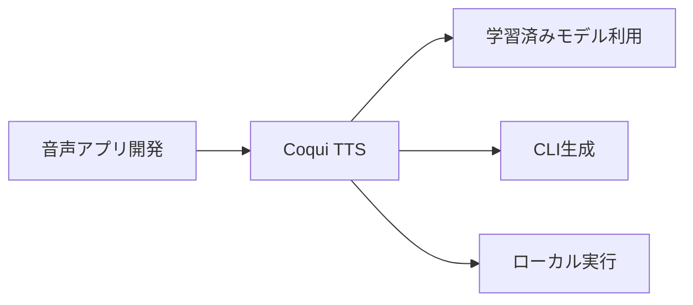
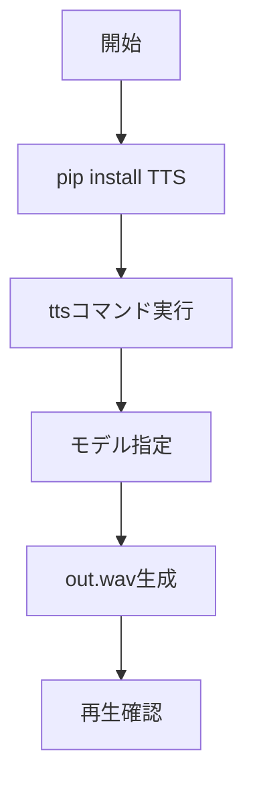

# Coqui TTS - 学習済みモデルを活用する音声合成OSS

> 📖 中級（概念・実践） | 前提: Python基礎 / LLMアプリの基本概念

## この教材で身につくこと

- Coqui TTS の主な役割と適用場面を説明できる
- Coqui TTS を最小構成で動かす手順を実行できる
- 学習済みモデルを切り替えて音声品質の差分を確認できる
- CLI で音声ファイルを生成し再生確認できる
- 導入時のメリットと注意点を整理できる

## 概要

**Coqui TTS** は音声合成モデルを扱うOSSです。TTS API や学習済みモデルの切り替えがしやすく、音声アプリ開発に向いています。

**バージョン**: 最新版 / OSS準拠（2026-05時点）  
**公式ドキュメント**: https://github.com/coqui-ai/TTS

## 位置づけ



Coqui TTS はテキスト入力を受け取り、複数の学習済みモデルを切り替えながら音声ファイルを生成します。ローカル完結でプライバシーを確保しつつ、多言語音声合成が必要な音声アプリ開発に向いています。

## 実行フロー



この教材では、Coqui TTS をインストールして CLI でモデルを指定し、音声ファイルを生成して再生確認するまでの流れを確認します。

## 最小セットアップ

### 必須スキル

- Python 基本（3.10以上推奨）
- 仮想環境の操作
- 音声出力環境

### 環境

- Python 3.10+
- pip
- 仮想環境（venv推奨）

### インストール

```bash
pip install TTS
```

### 実行

```bash
tts --text "こんにちは。Coqui TTS のテストです。" \
    --model_name tts_models/ja/kokoro/tacotron2-DDC \
    --out_path out.wav
```

OS標準プレイヤーで `out.wav` を再生して確認します。

## 実ソースコード

### セットアップ手順（最小）

```text
# Coqui TTS セットアップガイド

## インストール
pip install TTS

## 音声生成例
tts --text "こんにちは。Coqui TTS のテストです。" \
	--model_name tts_models/ja/kokoro/tacotron2-DDC \
	--out_path out.wav
```

## 演習課題

1. Coqui TTS を使う想定ユースケースを1つ定義し、入力テキストと出力音声ファイルの仕様を記録してください。
2. 最小構成で動かし、モデルを変えて音声品質の差分を確認してください。
3. Coqui TTS を使わない場合の代替手段（Piperなど）と比較し、選ぶ基準をまとめてください。

### 解答の目安

1. まず課題の目的を一文で明確化し、入力・出力を対応づけて記述します。
   確認ポイント: 何を変えて何を確認する課題かを第三者が読んで理解できること。
2. 最小構成で一度実行し、設定や条件を1つ変更して差分を比較します。
   確認ポイント: 変更前後の挙動差を具体的に説明できること。
3. 適用条件と代替手段を整理し、選択基準を短くまとめます。
   確認ポイント: なぜその手段を選ぶかを根拠付きで示せること。

## 理解度チェック

1. Coqui TTS の主な役割を1文で説明してください。
2. Coqui TTS を導入する際の最大のメリットと注意点は何ですか？
3. Coqui TTS が向かないユースケースとして、どのようなケースが考えられますか？

### 解説の要点

1. 主な役割は、その技術がどの工程を担い、何を改善するかで説明します。
2. メリットは再現性・拡張性・運用性の観点で整理し、注意点は導入コストや複雑性として示します。
3. 使い分けは要件、実装コスト、運用体制の3観点で判断します。

## 参考リンク

- [Coqui TTS GitHub リポジトリ](https://github.com/coqui-ai/TTS)
- [Coqui TTS モデル一覧](https://github.com/coqui-ai/TTS/blob/dev/TTS/.models.json)

---

[← 前へ](06-fooocus.md) | [次へ →](../07-visualization/01-vega-lite.md)
