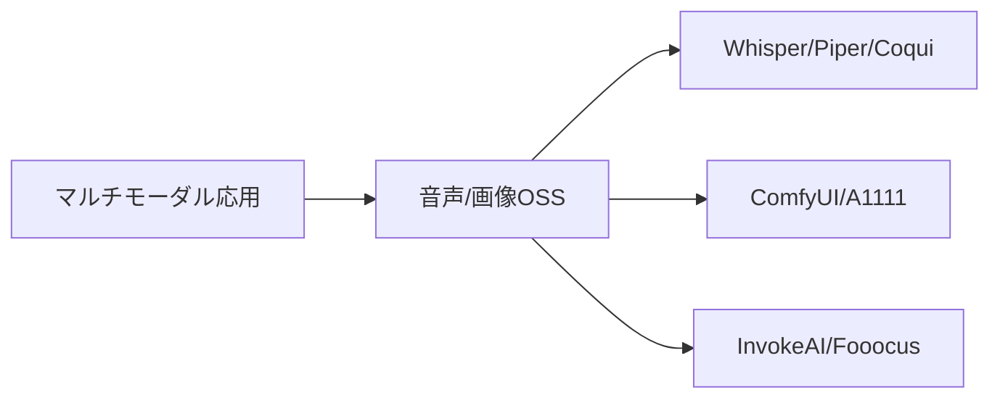
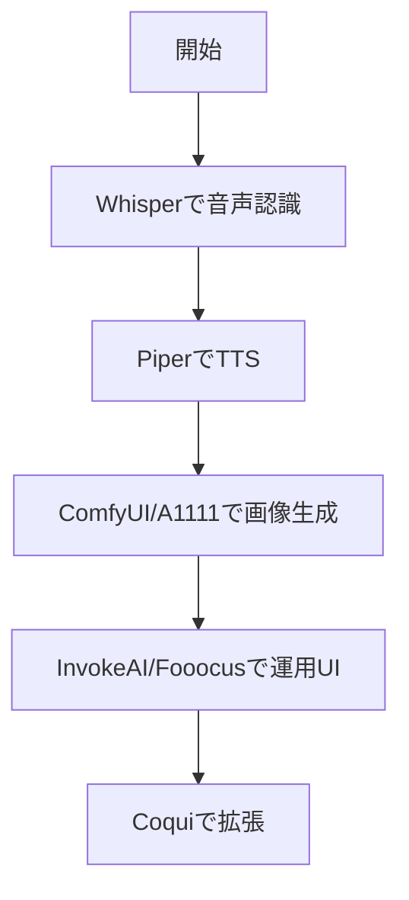

# マルチモーダル（音声・画像）

> 🔰 初級（カテゴリ導入） | 前提: -

音声認識や音声合成など、テキスト以外の入出力を扱う教材です。

## 位置づけ

## 学習フロー

## 含まれるOSS

- **Whisper**: 音声認識（Speech-to-Text）
- **Piper**: 音声合成（Text-to-Speech）
- **ComfyUI**: ノードベース画像生成
- **AUTOMATIC1111**: Stable Diffusion Web UI
- **InvokeAI**: 実務向け画像生成UI
- **Fooocus**: 使いやすさ重視の画像生成UI
- **Coqui TTS**: 音声合成フレームワーク

## 学習順序

1. Whisper（音声認識）
2. Piper（軽量TTS）
3. ComfyUI（ワークフロー型画像生成）
4. AUTOMATIC1111（画像生成API）
5. InvokeAI / Fooocus（用途別UI）
6. Coqui TTS（TTS拡張）

## 教材リンク

- [01_whisper.md](./01_whisper.md)
- [01_whisper-python](./01_whisper-python/)
- [02_piper.md](./02_piper.md)
- [03_comfyui.md](./03_comfyui.md)
- [03_comfyui-python](./03_comfyui-python/)
- [04_automatic1111.md](./04_automatic1111.md)
- [04_automatic1111-python](./04_automatic1111-python/)
- [05_invokeai.md](./05_invokeai.md)
- [06_fooocus.md](./06_fooocus.md)
- [07_coqui-tts.md](./07_coqui-tts.md)

## 完了条件

- カテゴリ内の主要OSSを3つ以上説明できる
- 最小サンプルを1件以上動作確認できる
- 選定観点（速度/運用性/拡張性）で比較メモを作成できる

---

[← 前へ](05_evaluation/04_guardrails.md) | [次へ →](06_multimodal/01_whisper.md)

