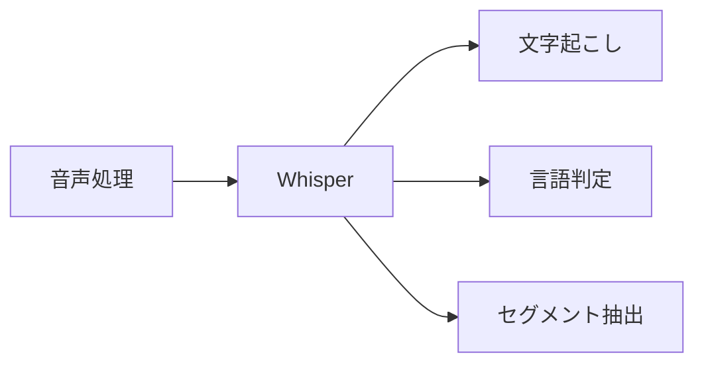
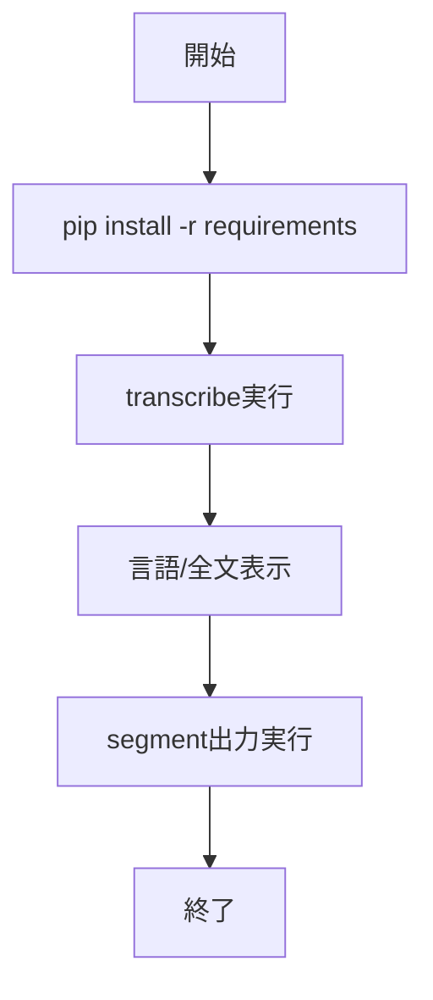

# Whisper 入門

> 📖 中級（概念・実践） | 前提: Python基礎 / LLMアプリの基本概念

## この教材で身につくこと

- 音声ファイルの文字起こし
- 言語推定
- セグメントごとの時刻情報取得

## コンセプト
Whisper は音声をテキストへ変換する OSS モデルです。会議録、動画字幕、音声ログ解析に使えます。

**バージョン**: 2026-05時点 / OSS準拠  
**公式ドキュメント**: https://github.com/openai/whisper

## 仕組み

1. 目的と入力を定義し、対象データや利用モデルを準備します。
2. コア処理（検索・推論・生成・検証のいずれか）を実行します。
3. 実行結果を保存または表示し、次工程に渡せる形式へ整えます。
4. パラメータを調整して挙動差分を比較し、品質を確認します。
5. 運用を想定して再実行手順と確認ポイントを定着させます。
## 位置づけ



## 実行フロー



## サンプル

### 実行例

```bash
# この教材の最小構成を順に実行
# 具体的なコマンドは「最小セットアップ」または「実行フロー」を参照
```

### 検証

- コマンドがエラーなく完了する
- 想定した出力（画面表示・ファイル生成・回答）を確認できる
- 変更した設定に応じて結果差分を説明できる
## 実ソースコード（言語別に記載）
### 00_requirements.txt

```txt
openai-whisper==20231117
torch==2.2.2
```

### 01_transcribe-file.py

```python
"""Whisper file transcription demo.
Usage: python 01_transcribe-file.py sample.wav
"""

import argparse
import whisper


def main() -> None:
	parser = argparse.ArgumentParser()
	parser.add_argument("audio_path", help="Path to audio file")
	parser.add_argument("--model", default="base", help="Whisper model size")
	args = parser.parse_args()

	model = whisper.load_model(args.model)
	result = model.transcribe(args.audio_path, fp16=False)

	print("Language:", result.get("language"))
	print("\nText:")
	print(result.get("text", ""))


if __name__ == "__main__":
	main()
```

### 02_segments.py

```python
"""Whisper segment-level output demo.
Usage: python 02_segments.py sample.wav
"""

import argparse
import whisper


def main() -> None:
	parser = argparse.ArgumentParser()
	parser.add_argument("audio_path")
	args = parser.parse_args()

	model = whisper.load_model("base")
	result = model.transcribe(args.audio_path, fp16=False)

	for seg in result.get("segments", []):
		start = seg.get("start", 0.0)
		end = seg.get("end", 0.0)
		text = seg.get("text", "").strip()
		print(f"[{start:6.2f}-{end:6.2f}] {text}")


if __name__ == "__main__":
	main()
```

## 実行
```bash
cd 01_whisper-python
pip install -r 00_requirements.txt
python 01_transcribe-file.py sample.wav
```

## 演習課題

1. ``Whisper 入門`` を使う想定ユースケースを1つ定義し、入力・出力の例を記録してください。
2. 最小構成で動かし、デフォルトから設定を1つ変えて挙動の差分を確認してください。
3. ``Whisper 入門`` を使わない場合の代替手段と比較し、選ぶ基準をまとめてください。


### 解答の目安

1. まず課題の目的を一文で明確化し、入力・出力を対応づけて記述します。
   確認ポイント: 何を変えて何を確認する課題かを第三者が読んで理解できること。
2. 最小構成で一度実行し、設定や条件を1つ変更して差分を比較します。
   確認ポイント: 変更前後の挙動差を具体的に説明できること。
3. 適用条件と代替手段を整理し、選択基準を短くまとめます。
   確認ポイント: なぜその手段を選ぶかを根拠付きで示せること。
## 理解度チェック

1. ``Whisper 入門`` の主な役割を1文で説明してください。
2. ``Whisper 入門`` を導入する際の最大のメリットと注意点は何ですか？
3. ``Whisper 入門`` が向かないユースケースとして、どのようなケースが考えられますか？


### 解説の要点

1. 主な役割は、その技術がどの工程を担い、何を改善するかで説明します。
2. メリットは再現性・拡張性・運用性の観点で整理し、注意点は導入コストや複雑性として示します。
3. 使い分けは要件、実装コスト、運用体制の3観点で判断します。
---

[← 前へ](06_multimodal/00_README.md) | [次へ →](06_multimodal/02_piper.md)


