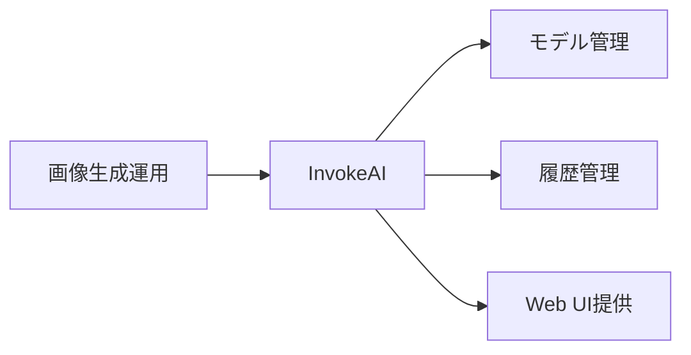
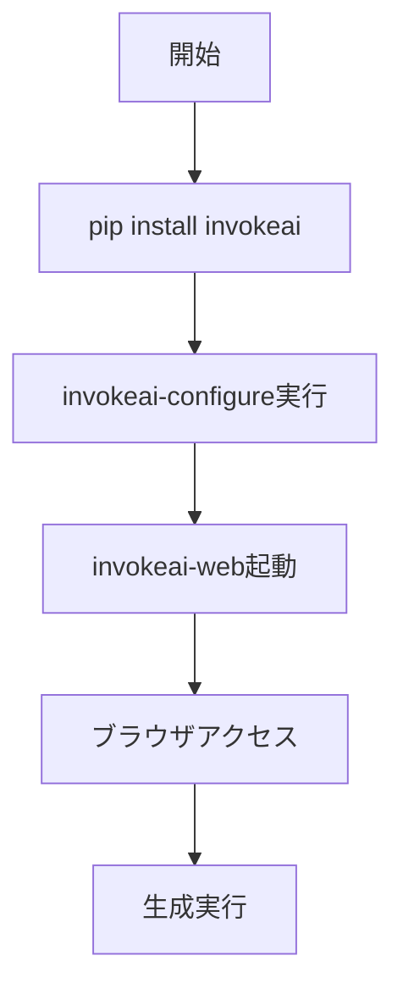

# InvokeAI 入門

> 📖 中級（概念・実践） | 前提: Python基礎 / LLMアプリの基本概念

## この教材で身につくこと

- InvokeAI 入門 の主な役割と適用場面を説明できる
- InvokeAI 入門 を最小構成で動かす手順を実行できる
- 導入時のメリットと注意点を整理できる

## 概要
InvokeAI は実務向け機能を備えた画像生成ツールです。モデル管理や履歴管理がしやすく、運用寄りの構成に向きます。

## 詳細
- モデル管理と生成履歴管理
- ローカルWeb UI運用
- 実運用向けの安定した画像生成

## 位置づけ（Mermaid）



## 実行フロー（Mermaid）



## 実ソースコード（言語別に記載）
### セットアップ手順（最小）

```text
# InvokeAI セットアップガイド

## インストール
pip install invokeai
invokeai-configure

## 起動
invokeai-web

## アクセス
- http://127.0.0.1:9090
```

## 演習課題

1. ``InvokeAI 入門`` を使う想定ユースケースを1つ定義し、入力・出力の例を記録してください。
2. 最小構成で動かし、デフォルトから設定を1つ変えて挙動の差分を確認してください。
3. ``InvokeAI 入門`` を使わない場合の代替手段と比較し、選ぶ基準をまとめてください。


### 解答の目安

1. まず課題の目的を一文で明確化し、入力・出力を対応づけて記述します。
   確認ポイント: 何を変えて何を確認する課題かを第三者が読んで理解できること。
2. 最小構成で一度実行し、設定や条件を1つ変更して差分を比較します。
   確認ポイント: 変更前後の挙動差を具体的に説明できること。
3. 適用条件と代替手段を整理し、選択基準を短くまとめます。
   確認ポイント: なぜその手段を選ぶかを根拠付きで示せること。
## 理解度チェック

1. ``InvokeAI 入門`` の主な役割を1文で説明してください。
2. ``InvokeAI 入門`` を導入する際の最大のメリットと注意点は何ですか？
3. ``InvokeAI 入門`` が向かないユースケースとして、どのようなケースが考えられますか？


### 解説の要点

1. 主な役割は、その技術がどの工程を担い、何を改善するかで説明します。
2. メリットは再現性・拡張性・運用性の観点で整理し、注意点は導入コストや複雑性として示します。
3. 使い分けは要件、実装コスト、運用体制の3観点で判断します。
---

[← 前へ](06_multimodal/04_automatic1111.md) | [次へ →](06_multimodal/06_fooocus.md)


