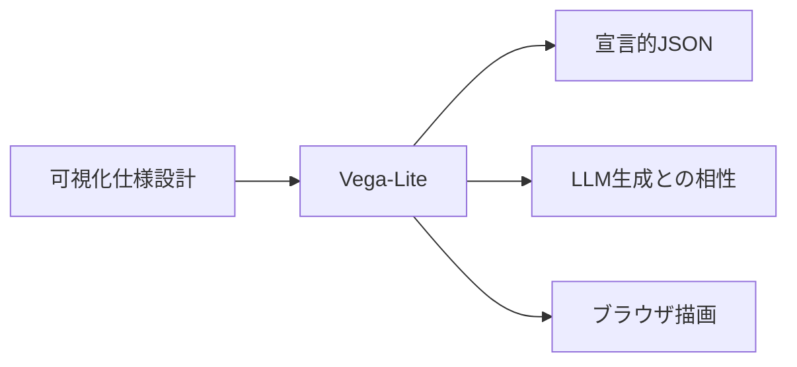
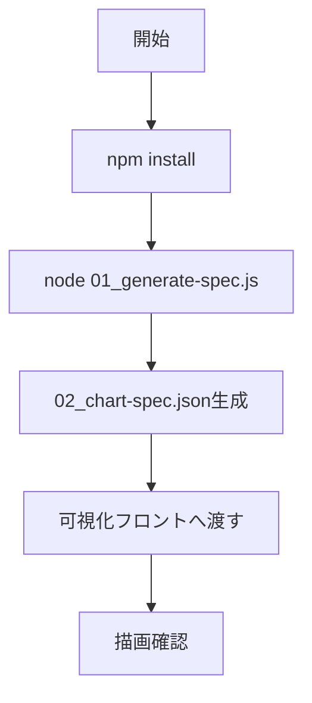
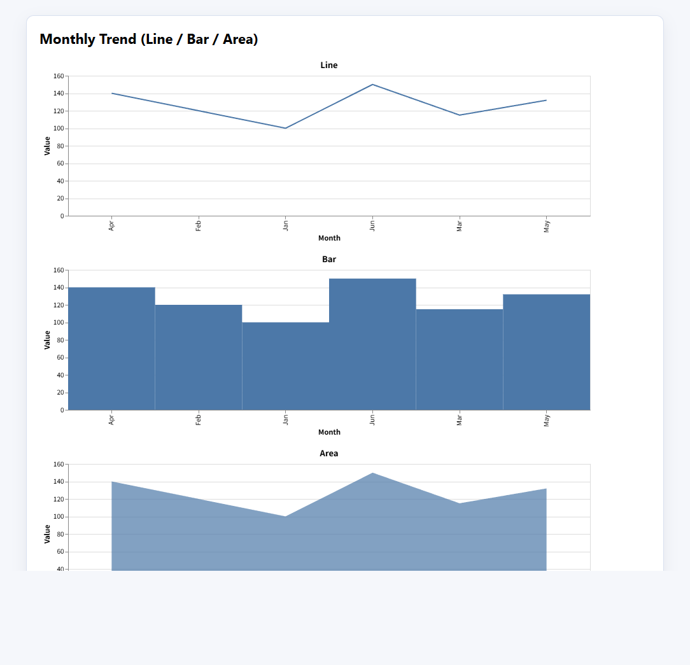

# Vega-Lite - 宣言的JSONで可視化を定義するライブラリ

> 📖 中級（概念・実践） | 前提: Python基礎 / LLMアプリの基本概念

## この教材で身につくこと

- JSON仕様でグラフを定義できる
- 折れ線・棒・エリアなど基本チャートを作成できる
- 生成した仕様をフロントエンドへ渡す流れを説明できる
- LLMを使って可視化仕様を自動生成するパイプラインを構築できる

## 概要

**Vega-Lite** は、可視化を宣言的JSONで記述するライブラリです。
LLMが仕様生成しやすく、可視化パイプラインの自動化と相性が良いのが特徴です。

LLMと相性が良い主な理由は、出力フォーマットが自然言語ではなく構造化JSONである点です。  
たとえば「売上推移を月次で折れ線表示し、ツールチップに値を出す」といった要件を、`mark` / `encoding` / `tooltip` のような定型キーにマッピングして生成できます。

また、Vega-Lite 仕様は次の運用フローに載せやすいのも利点です。

1. プロンプトで可視化要件を文章で与える
2. LLMがVega-Lite JSONを生成する
3. スキーマや必須キー（`$schema`, `data`, `mark`, `encoding`）を機械的に検証する
4. 差分レビューで「何を変えたか」を追跡する

このため、試作段階では生成速度を上げやすく、運用段階ではレビュー性と再現性を確保しやすい、というバランスが取りやすくなります。

**バージョン**: 5.x / OSS準拠（2026-05時点）  
**公式ドキュメント**: https://vega.github.io/vega-lite/

## 位置づけ



## 実行フロー



## 最小セットアップ

```bash
cd examples/vega-lite
npm install
node 01_generate-spec.js
```

### サンプル整合性メモ

- `01_generate-spec.js` は 3 種類（`line` / `bar` / `area`）のチャート仕様を1つのJSONとして生成
- `02_chart-spec.json` には `vconcat` 配下に 3 つのチャートが含まれる

### 実行例

```bash
cd examples/vega-lite
node 01_generate-spec.js
python -m http.server 8017
```

ブラウザで `http://localhost:8017/03_render.html` を開くと、3種類のチャートが表示されます。

### 検証

- コマンドがエラーなく完了する
- 想定した出力（画面表示・ファイル生成・回答）を確認できる
- 変更した設定に応じて結果差分を説明できる

### 描画結果（3種類）



## 実ソースコード

### JavaScript: examples/vega-lite/01_generate-spec.js

- 役割: Vega-Lite 仕様JSONを生成してファイル出力
- 入力: 月次データ配列（スクリプト内定義）
- 出力: `examples/vega-lite/02_chart-spec.json`
- 実行: `cd examples/vega-lite && node 01_generate-spec.js`

```javascript
import fs from "node:fs";

const data = [
  { month: "Jan", value: 100 },
  { month: "Feb", value: 120 },
  { month: "Mar", value: 115 },
  { month: "Apr", value: 140 },
  { month: "May", value: 132 },
  { month: "Jun", value: 150 },
];

const CHART_WIDTH = 820;
const CHART_HEIGHT = 220;

const spec = {
  $schema: "https://vega.github.io/schema/vega-lite/v5.json",
  description: "Monthly trend with 3 chart types",
  data: { values: data },
  vconcat: [
    {
      title: "Line",
      width: CHART_WIDTH,
      height: CHART_HEIGHT,
      mark: "line",
      encoding: {
        x: { field: "month", type: "ordinal", title: "Month" },
        y: { field: "value", type: "quantitative", title: "Value" },
        tooltip: [
          { field: "month", type: "ordinal" },
          { field: "value", type: "quantitative" },
        ],
      },
    },
    {
      title: "Bar",
      width: CHART_WIDTH,
      height: CHART_HEIGHT,
      mark: "bar",
      encoding: {
        x: { field: "month", type: "ordinal", title: "Month" },
        y: { field: "value", type: "quantitative", title: "Value" },
        tooltip: [
          { field: "month", type: "ordinal" },
          { field: "value", type: "quantitative" },
        ],
      },
    },
    {
      title: "Area",
      width: CHART_WIDTH,
      height: CHART_HEIGHT,
      mark: { type: "area", opacity: 0.7 },
      encoding: {
        x: { field: "month", type: "ordinal", title: "Month" },
        y: { field: "value", type: "quantitative", title: "Value" },
        tooltip: [
          { field: "month", type: "ordinal" },
          { field: "value", type: "quantitative" },
        ],
      },
    },
  ],
  spacing: 20,
};

fs.writeFileSync("02_chart-spec.json", JSON.stringify(spec, null, 2), "utf-8");
console.log("Generated 02_chart-spec.json");
```

### JSON: examples/vega-lite/02_chart-spec.json

- 役割: 可視化フロントに渡す最終仕様
- 入力: なし（`examples/vega-lite/01_generate-spec.js` で生成される）
- 出力: Vega-Lite描画用JSON

```json
{
  "$schema": "https://vega.github.io/schema/vega-lite/v5.json",
  "description": "Monthly trend with 3 chart types",
  "data": {
    "values": [
      { "month": "Jan", "value": 100 },
      { "month": "Feb", "value": 120 },
      { "month": "Mar", "value": 115 },
      { "month": "Apr", "value": 140 },
      { "month": "May", "value": 132 },
      { "month": "Jun", "value": 150 }
    ]
  },
  "vconcat": [
    {
      "title": "Line",
      "width": 820,
      "height": 220,
      "mark": "line",
      "encoding": {
        "x": { "field": "month", "type": "ordinal", "title": "Month" },
        "y": { "field": "value", "type": "quantitative", "title": "Value" }
      }
    },
    {
      "title": "Bar",
      "width": 820,
      "height": 220,
      "mark": "bar",
      "encoding": {
        "x": { "field": "month", "type": "ordinal", "title": "Month" },
        "y": { "field": "value", "type": "quantitative", "title": "Value" }
      }
    },
    {
      "title": "Area",
      "width": 820,
      "height": 220,
      "mark": { "type": "area", "opacity": 0.7 },
      "encoding": {
        "x": { "field": "month", "type": "ordinal", "title": "Month" },
        "y": { "field": "value", "type": "quantitative", "title": "Value" }
      }
    }
  ],
  "spacing": 20
}
```

### 生成JSONの読み解きポイント

1. 入口は `$schema` と `description`
  確認ポイント: どの仕様バージョンで、何を描くJSONかを最初に把握する。
2. データ本体は `data.values`
  確認ポイント: ここを書き換えると、同じ可視化ルールでデータ差し替えができる。
3. 表現の切り替えは `vconcat` 配下
  確認ポイント: 各要素が1チャートを表し、`mark` を変えることで同一データの見え方を比較できる。
4. 軸定義は `encoding.x` と `encoding.y`
  確認ポイント: `field` は列名、`type` はデータ型であり、ここが崩れると描画解釈が変わる。
5. レイアウト調整は `width` / `height` / `spacing`
  確認ポイント: 意味は変えずに可読性だけを調整したい場合は、この3点を先に触る。

このJSONは「データ」と「表現ルール」を分離しているため、LLMが生成してもレビューしやすく、どこを変えると何が変わるかを追跡しやすい構造になっています。

## 演習課題

1. 月次データを5点以上に増やし、折れ線の変化を確認してください。
2. `line` / `bar` / `area` の3種類を比較し、同じデータで表現差を確認してください。
3. タイトルと軸ラベルを業務データ向けに変更してください。

### 解答の目安

1. 月次データを5点以上に増やし、上昇と下降の両方が見える形にします。
  確認ポイント: x軸カテゴリが増え、折れ線の形が変化していること。
2. `line` / `bar` / `area` を切り替えて比較します。
  確認ポイント: `line` は推移把握、`bar` はカテゴリ比較、`area` は量感の把握に強いと説明できること。
3. タイトルと軸ラベルを業務文脈に合わせて変更します。
  確認ポイント: 指標名と単位が第三者に明確に伝わること。

## 理解度チェック

1. Vega-Lite の主な役割を1文で説明してください。
2. 宣言的仕様を採用する利点は何ですか？
3. ECharts と使い分けるなら、どの観点で判断しますか？
4. 生成された `02_chart-spec.json` で「折れ線を棒グラフに変える」には、どのキーを変更しますか？
5. `data.values` と `encoding` はそれぞれ何を担当していますか？

### 解説の要点

1. Vega-Lite の役割は、宣言的なJSON仕様で可視化を定義し、再利用しやすくすることです。
2. 宣言的仕様の利点は、生成しやすいこと、差分レビューしやすいこと、構成を標準化しやすいことです。
3. 使い分けは、仕様生成や標準化を重視するならVega-Lite、細かなインタラクションや高度なUI制御を重視するならEChartsが目安です。
4. `vconcat` 配下の該当チャートの `mark` キーを `"bar"` に変更します。他の設定（encoding・data）は変えずにチャート形式だけを切り替えられるのが宣言的仕様の利点です。
5. `data.values` は描画するデータ本体を、`encoding` は各フィールドをどの軸・どの見た目に対応させるかを担当します。この2つを分離することで、データが変わってもルールを使い回せます。

---

## 参考リンク

- [Vega-Lite 公式ドキュメント](https://vega.github.io/vega-lite/)
- [Vega-Lite Examples Gallery](https://vega.github.io/vega-lite/examples/)
- [GitHub Repository](https://github.com/vega/vega-lite)

---

[← 前へ](00-README.md) | [次へ →](02-echarts.md)
