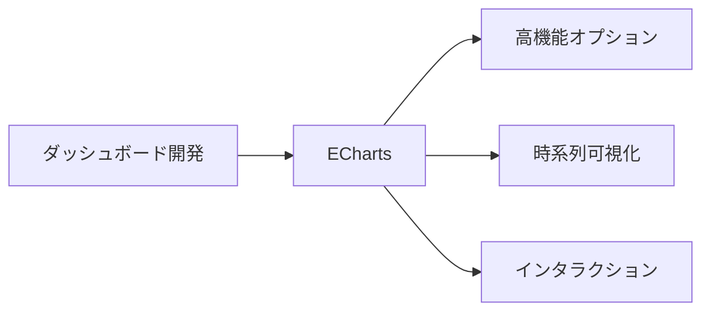
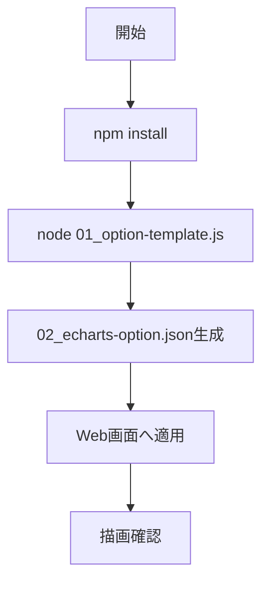
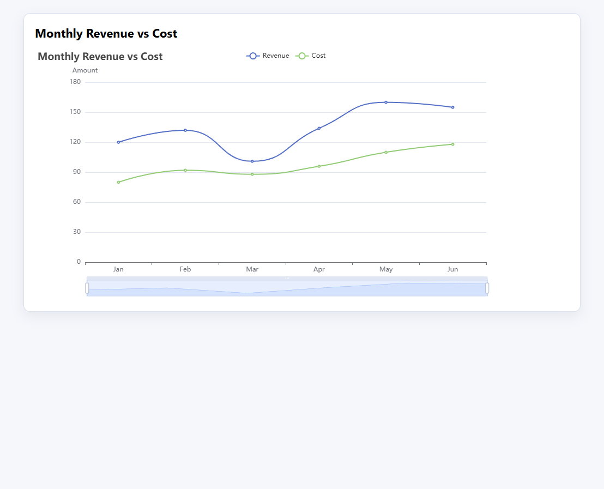

# ECharts 入門

> 📖 中級（概念・実践） | 前提: Python基礎 / LLMアプリの基本概念

## この教材で身につくこと

- 複数系列の時系列チャート
- インタラクティブなズーム・ツールチップ
- 大量データ描画

## コンセプト
ECharts は高機能で拡張性の高い可視化ライブラリです。ダッシュボードや時系列表示に向きます。

とくに、複数系列・ズーム・凡例連動・ツールチップなど、実務でよく使う要件を1つの option でまとめて表現できる点が強みです。  
LLMと組み合わせる場合も、要件を「系列」「軸」「インタラクション」に分解して option に落とし込めるため、試作から改善までを繰り返しやすくなります。

**バージョン**: 5.x / OSS準拠（2026-05時点）  
**公式ドキュメント**: https://echarts.apache.org/

## 仕組み

1. 目的と入力を定義し、対象データや利用モデルを準備します。
2. コア処理（検索・推論・生成・検証のいずれか）を実行します。
3. 実行結果を保存または表示し、次工程に渡せる形式へ整えます。
4. パラメータを調整して挙動差分を比較し、品質を確認します。
5. 運用を想定して再実行手順と確認ポイントを定着させます。
## 位置づけ



## 実行フロー



## 最小実行

```bash
cd examples/echarts
npm install
node 01_option-template.js
```

## サンプル整合性メモ

- `01_option-template.js` は 2 系列（`Revenue` / `Cost`）の line チャート option を生成
- `02_echarts-option.json` には `tooltip` と `dataZoom` が含まれ、時系列の読み取りと拡大確認ができる

## サンプル

### 実行例

```bash
# この教材の最小構成を順に実行
# 具体的なコマンドは「最小セットアップ」または「実行フロー」を参照
cd examples/echarts
node 01_option-template.js
python -m http.server 8019
```

ブラウザで `http://localhost:8019/03_render.html` を開くと、複数系列チャートが表示されます。

### 検証

- コマンドがエラーなく完了する
- 想定した出力（画面表示・ファイル生成・回答）を確認できる
- 変更した設定に応じて結果差分を説明できる

### 描画結果（複数系列）



## 実ソースコード（言語別に記載）
### JSON: examples/echarts/package.json

- 役割: 実行スクリプト定義
- 入力: なし
- 出力: `generate` スクリプトで option JSON を生成

```json
{
	"name": "echarts-tutorial",
	"version": "1.0.0",
	"private": true,
	"type": "module",
	"scripts": {
		"generate": "node 01_option-template.js"
	}
}
```

### JavaScript: examples/echarts/01_option-template.js

- 役割: ECharts option JSONを生成してファイル出力
- 入力: 月次配列、売上配列、コスト配列（スクリプト内定義）
- 出力: `examples/echarts/02_echarts-option.json`
- 実行: `cd examples/echarts && node 01_option-template.js`

```javascript
import fs from "node:fs";

const months = ["Jan", "Feb", "Mar", "Apr", "May", "Jun"];
const revenue = [120, 132, 101, 134, 160, 155];
const cost = [80, 92, 88, 96, 110, 118];

const option = {
	title: { text: "Monthly Revenue vs Cost" },
	tooltip: { trigger: "axis" },
	legend: { data: ["Revenue", "Cost"] },
	xAxis: {
		type: "category",
		data: months,
	},
	yAxis: {
		type: "value",
		name: "Amount",
	},
	dataZoom: [
		{ type: "inside", start: 0, end: 100 },
		{ start: 0, end: 100 },
	],
	series: [
		{
			name: "Revenue",
			type: "line",
			smooth: true,
			data: revenue,
		},
		{
			name: "Cost",
			type: "line",
			smooth: true,
			data: cost,
		},
	],
};

fs.writeFileSync("02_echarts-option.json", JSON.stringify(option, null, 2), "utf-8");
console.log("Generated 02_echarts-option.json");
```

### JSON: examples/echarts/02_echarts-option.json

- 役割: Web画面に渡す最終 option
- 入力: なし（`examples/echarts/01_option-template.js` で生成される）
- 出力: ECharts 描画用JSON

```json
{
	"title": { "text": "Monthly Revenue vs Cost" },
	"tooltip": { "trigger": "axis" },
	"legend": { "data": ["Revenue", "Cost"] },
	"xAxis": {
		"type": "category",
		"data": ["Jan", "Feb", "Mar", "Apr", "May", "Jun"]
	},
	"yAxis": {
		"type": "value",
		"name": "Amount"
	},
	"dataZoom": [
		{ "type": "inside", "start": 0, "end": 100 },
		{ "start": 0, "end": 100 }
	],
	"series": [
		{
			"name": "Revenue",
			"type": "line",
			"smooth": true,
			"data": [120, 132, 101, 134, 160, 155]
		},
		{
			"name": "Cost",
			"type": "line",
			"smooth": true,
			"data": [80, 92, 88, 96, 110, 118]
		}
	]
}
```

### 生成JSONの読み解きポイント

1. 全体設定は `title` / `tooltip` / `legend`
	確認ポイント: 画面で最初に見える情報と、ユーザー操作時の補助情報を定義している。
2. 軸定義は `xAxis` と `yAxis`
	確認ポイント: 時系列カテゴリ（`xAxis.data`）と数値スケール（`yAxis`）の責務が分かれている。
3. インタラクションは `dataZoom`
	確認ポイント: `inside` を含めるとマウス操作で拡大縮小でき、大量データでも確認しやすい。
4. 主役は `series`
	確認ポイント: 配列の1要素が1系列を表し、`name` と `data` を揃えることで比較チャートになる。
5. 見た目調整は `type` / `smooth`
	確認ポイント: 折れ線か棒か、補間するかを系列単位で切り替えられる。

EChartsのJSONは「画面機能（ズーム・凡例・ツールチップ）」をまとめて持てるため、実運用で必要な操作性を1つの option で管理しやすい構造です。

### Vega-LiteとEChartsのJSON比較（理解を深める観点）

1. Vega-Lite: `encoding` 中心
	データ列と見た目の対応を宣言的に書く。
2. ECharts: `series` と機能設定中心
	チャート機能やインタラクションを option として具体的に組み立てる。
3. 学習時の見分け方
	「列の対応関係を先に考える」ならVega-Lite、「UI操作まで含めて設計する」ならEChartsが読みやすい。

## 演習課題

1. ``ECharts 入門`` を使う想定ユースケースを1つ定義し、入力・出力の例を記録してください。
2. 最小構成で動かし、デフォルトから設定を1つ変えて挙動の差分を確認してください。
3. ``ECharts 入門`` を使わない場合の代替手段と比較し、選ぶ基準をまとめてください。

### 解答の目安

1. ユースケースを具体化し、入力データ項目と出力チャートを対応づけて記述します。
	確認ポイント: 何を可視化し、何を判断したいかが明確であること。
2. 最小構成から設定を1つ変更して差分を確認します。
	例: `smooth` を `true` と `false` で比較する。
	確認ポイント: 設定値の変更が見た目や読み取り方にどう影響するか説明できること。
3. 代替手段と比較し、選択基準を整理します。
	確認ポイント: 自由度、学習コスト、用途適合の3観点で比較できること。

## 理解度チェック

1. ECharts の主な役割を1文で説明してください。
2. ECharts を導入する際の最大のメリットと注意点は何ですか？
3. ECharts が向かないユースケースとして、どのようなケースが考えられますか？
4. 生成された `02_echarts-option.json` で「ズーム機能を無効にする」には、どのキーを削除または変更しますか？
5. `series` 配列に要素を追加すると何が変わりますか？

### 解説の要点

1. ECharts の主な役割は、実運用向けの高機能な可視化を構築することです。
2. 最大のメリットは表現力と機能性の高さで、注意点は設定項目が多く設計が複雑化しやすいことです。
3. 単純な静的可視化だけで十分な場合や、仕様を最小に保ちたい場合は別手段が適することがあります。
4. `dataZoom` キーを削除するか空配列 `[]` にすることで無効化できます。`dataZoom` はズーム機能の宣言であり、ここを削除しても他の設定には影響しません。
5. `series` の配列要素が1つ増えると、チャートに1系列が追加されます。`name` と `data` を対応させるだけで複数系列の比較チャートに拡張でき、`legend` に `name` を追加すれば凡例にも自動反映されます。

---

[← 前へ](07-visualization/01-vega-lite.md) | [次へ →](08-protocols/00-README.md)