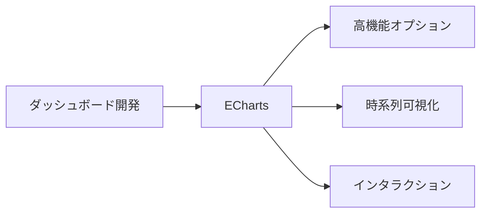
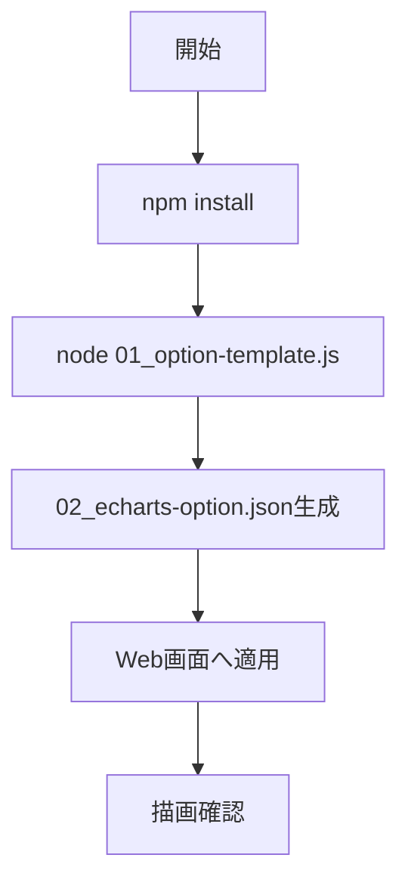

# ECharts 入門

> 📖 中級（概念・実践） | 前提: Python基礎 / LLMアプリの基本概念

## この教材で身につくこと

- 複数系列の時系列チャート
- インタラクティブなズーム・ツールチップ
- 大量データ描画

## コンセプト
ECharts は高機能で拡張性の高い可視化ライブラリです。ダッシュボードや時系列表示に向きます。

**バージョン**: 5.x / OSS準拠（2026-05時点）  
**公式ドキュメント**: https://echarts.apache.org/

## 仕組み

1. 目的と入力を定義し、対象データや利用モデルを準備します。
2. コア処理（検索・推論・生成・検証のいずれか）を実行します。
3. 実行結果を保存または表示し、次工程に渡せる形式へ整えます。
4. パラメータを調整して挙動差分を比較し、品質を確認します。
5. 運用を想定して再実行手順と確認ポイントを定着させます。
## 位置づけ



## 実行フロー



## サンプル

### 実行例

```bash
# この教材の最小構成を順に実行
# 具体的なコマンドは「最小セットアップ」または「実行フロー」を参照
```

### 検証

- コマンドがエラーなく完了する
- 想定した出力（画面表示・ファイル生成・回答）を確認できる
- 変更した設定に応じて結果差分を説明できる
## 実ソースコード（言語別に記載）
### 02_echarts-js/00_package.json

```json
{
	"name": "echarts-tutorial",
	"version": "1.0.0",
	"private": true,
	"type": "module",
	"scripts": {
		"start": "node 01_option-template.js"
	}
}
```

### 02_echarts-js/01_option-template.js

```javascript
import fs from "node:fs";

const option = {
	title: { text: "Monthly Revenue" },
	tooltip: { trigger: "axis" },
	xAxis: {
		type: "category",
		data: ["Jan", "Feb", "Mar", "Apr"],
	},
	yAxis: { type: "value" },
	series: [
		{
			name: "Revenue",
			type: "line",
			data: [120, 132, 101, 134],
			smooth: true,
		},
	],
};

fs.writeFileSync("02_echarts-option.json", JSON.stringify(option, null, 2), "utf-8");
console.log("Generated 02_echarts-option.json");
```

### 02_echarts-js/02_echarts-option.json

```json
{
	"title": { "text": "Monthly Revenue" },
	"tooltip": { "trigger": "axis" },
	"xAxis": {
		"type": "category",
		"data": ["Jan", "Feb", "Mar", "Apr"]
	},
	"yAxis": { "type": "value" },
	"series": [
		{
			"name": "Revenue",
			"type": "line",
			"data": [120, 132, 101, 134],
			"smooth": true
		}
	]
}
```

## 演習課題

1. ``ECharts 入門`` を使う想定ユースケースを1つ定義し、入力・出力の例を記録してください。
2. 最小構成で動かし、デフォルトから設定を1つ変えて挙動の差分を確認してください。
3. ``ECharts 入門`` を使わない場合の代替手段と比較し、選ぶ基準をまとめてください。

### 解答の目安

1. ユースケースを具体化し、入力データ項目と出力チャートを対応づけて記述します。
	確認ポイント: 何を可視化し、何を判断したいかが明確であること。
2. 最小構成から設定を1つ変更して差分を確認します。
	例: `smooth` を `true` と `false` で比較する。
	確認ポイント: 設定値の変更が見た目や読み取り方にどう影響するか説明できること。
3. 代替手段と比較し、選択基準を整理します。
	確認ポイント: 自由度、学習コスト、用途適合の3観点で比較できること。

## 理解度チェック

1. ``ECharts 入門`` の主な役割を1文で説明してください。
2. ``ECharts 入門`` を導入する際の最大のメリットと注意点は何ですか？
3. ``ECharts 入門`` が向かないユースケースとして、どのようなケースが考えられますか？

### 解説の要点

1. ECharts の主な役割は、実運用向けの高機能な可視化を構築することです。
2. 最大のメリットは表現力と機能性の高さで、注意点は設定項目が多く設計が複雑化しやすいことです。
3. 単純な静的可視化だけで十分な場合や、仕様を最小に保ちたい場合は別手段が適することがあります。

---

[← 前へ](07-visualization/01-vega-lite.md) | [次へ →](08-protocols/00-README.md)


