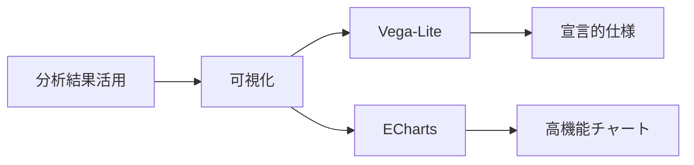
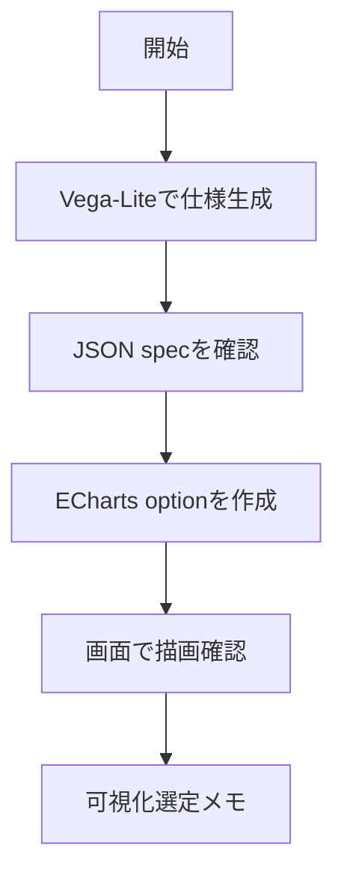

---
level: 🔰 初級（カテゴリ導入）
prereq: -
prev: 06_multimodal/07_coqui-tts.md
next: 07_visualization/01_vega-lite.md
---

# データ可視化

> 🔰 初級（カテゴリ導入） | 前提: -

LLMの出力や分析結果を視覚化するための教材です。

## 位置づけ（Mermaid）

## 学習フロー（Mermaid）

## 含まれるOSS
- Vega-Lite: 宣言的可視化仕様
- ECharts: 高機能チャートライブラリ

## 教材リンク
- [01_vega-lite.md](./01_vega-lite.md)
- [01_vega-lite-js](./01_vega-lite-js/)
- [02_echarts.md](./02_echarts.md)
- [02_echarts-js](./02_echarts-js/)

## 完了条件

- カテゴリ内の主要OSSを3つ以上説明できる
- 最小サンプルを1件以上動作確認できる
- 選定観点（速度/運用性/拡張性）で比較メモを作成できる

---

[← 前へ](06_multimodal/07_coqui-tts.md) | [次へ →](07_visualization/01_vega-lite.md)

