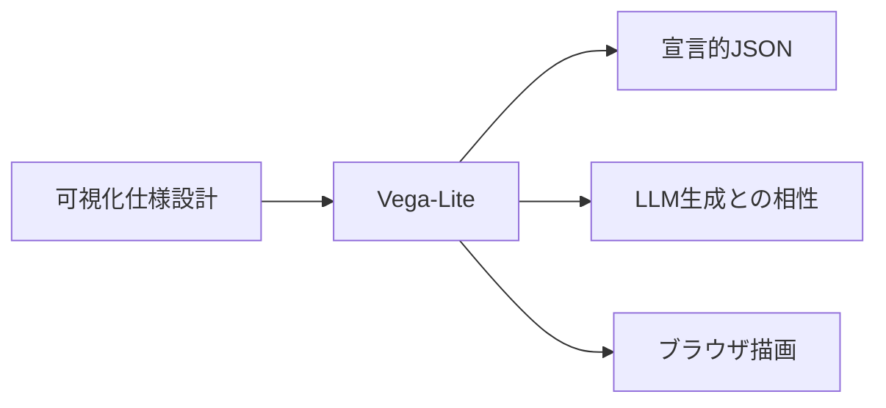
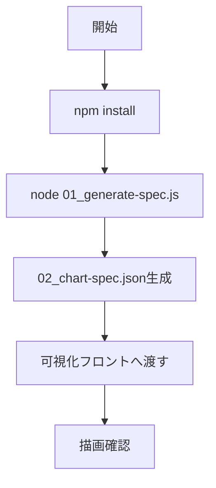

# Vega-Lite 入門

> 📖 中級（概念・実践） | 前提: Python基礎 / LLMアプリの基本概念

## この教材で身につくこと

- JSON仕様でグラフを定義する方法
- 基本チャート（棒・折れ線）の作成
- 生成した仕様をフロントへ渡す流れ

## 概要

Vega-Lite は、可視化を宣言的JSONで記述するライブラリです。
LLMが仕様生成しやすく、可視化パイプラインの自動化と相性が良いのが特徴です。

## 位置づけ（Mermaid）



## 実行フロー（Mermaid）



## 最小実行

```bash
cd 01_vega-lite-js
npm install
node 01_generate-spec.js
```

## サンプル整合性メモ

- `01_generate-spec.js` は折れ線グラフ（`mark: "line"`）を生成
- `02_chart-spec.json` は現在 `mark: "bar"` になっているため、`node 01_generate-spec.js` 実行で `line` に再生成されることを確認する


## 実ソースコード（言語別に記載）

### JavaScript: 01_generate-spec.js

- 役割: Vega-Lite 仕様JSONを生成してファイル出力
- 入力: 月次データ配列（スクリプト内定義）
- 出力: `02_chart-spec.json`
- 実行: `node 01_generate-spec.js`

```javascript
import fs from "node:fs";

const data = [
  { month: "Jan", value: 100 },
  { month: "Feb", value: 120 },
  { month: "Mar", value: 115 },
  { month: "Apr", value: 140 },
];

const spec = {
  $schema: "https://vega.github.io/schema/vega-lite/v5.json",
  description: "Simple monthly trend",
  data: { values: data },
  mark: "line",
  encoding: {
    x: { field: "month", type: "ordinal", title: "Month" },
    y: { field: "value", type: "quantitative", title: "Value" },
    tooltip: [
      { field: "month", type: "ordinal" },
      { field: "value", type: "quantitative" },
    ],
  },
};

fs.writeFileSync("02_chart-spec.json", JSON.stringify(spec, null, 2), "utf-8");
console.log("Generated 02_chart-spec.json");
```

### JSON: 02_chart-spec.json

- 役割: 可視化フロントに渡す最終仕様
- 入力: なし（`01_generate-spec.js` で生成される）
- 出力: Vega-Lite描画用JSON

```json
{
  "$schema": "https://vega.github.io/schema/vega-lite/v5.json",
  "description": "Simple monthly trend",
  "data": {
    "values": [
      { "month": "Jan", "value": 100 },
      { "month": "Feb", "value": 120 },
      { "month": "Mar", "value": 115 },
      { "month": "Apr", "value": 140 }
    ]
  },
  "mark": "bar",
  "encoding": {
    "x": { "field": "month", "type": "ordinal", "title": "Month" },
    "y": { "field": "value", "type": "quantitative", "title": "Value" }
  }
}
```

## 演習課題

1. 月次データを5点以上に増やし、折れ線の変化を確認してください。
2. `mark` を `bar` に変更し、同じデータで表現差を比較してください。
3. タイトルと軸ラベルを業務データ向けに変更してください。

### 解答の目安

1. 月次データを5点以上に増やし、上昇と下降の両方が見える形にします。
  確認ポイント: x軸カテゴリが増え、折れ線の形が変化していること。
2. `mark` を `line` と `bar` で切り替えて比較します。
  確認ポイント: `line` は推移把握に強く、`bar` は月ごとの比較に強いと説明できること。
3. タイトルと軸ラベルを業務文脈に合わせて変更します。
  確認ポイント: 指標名と単位が第三者に明確に伝わること。

## 理解度チェック

1. Vega-Lite の主な役割を1文で説明してください。
2. 宣言的仕様を採用する利点は何ですか？
3. ECharts と使い分けるなら、どの観点で判断しますか？

### 解説の要点

1. Vega-Lite の役割は、宣言的なJSON仕様で可視化を定義し、再利用しやすくすることです。
2. 宣言的仕様の利点は、生成しやすいこと、差分レビューしやすいこと、構成を標準化しやすいことです。
3. 使い分けは、仕様生成や標準化を重視するならVega-Lite、細かなインタラクションや高度なUI制御を重視するならEChartsが目安です。

---

[← 前へ](07_visualization/00_README.md) | [次へ →](07_visualization/02_echarts.md)

