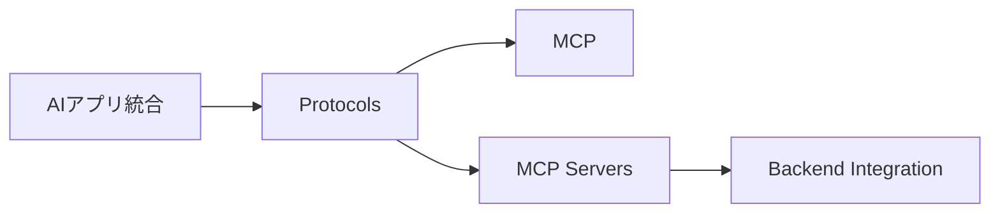
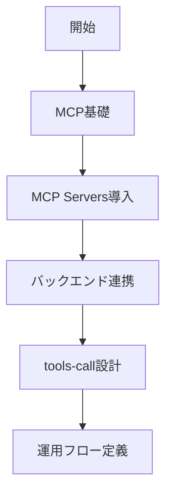

# プロトコル・標準・統合

> 🔰 初級（カテゴリ導入） | 前提: -

AIアプリと外部ツールを安全に統合するための標準を学ぶ教材です。

## 位置づけ

## 学習フロー

## 含まれるOSS

- **MCP**: Model Context Protocol
- **MCP Servers**: MCP対応サーバ実装群

## 学習順序

1. MCP（プロトコル基礎）
2. MCP Servers（サーバ実装パターン）
3. Backend Integration（業務システム連携）

## 教材リンク

- [01-mcp.md](./01-mcp.md)
- [01_mcp-python](./01_mcp-python/)
- [02-mcp-servers.md](./02-mcp-servers.md)
- [03-backend-integration.md](./03-backend-integration.md)
- [03_backend-integration-python](./03_backend-integration-python/)

## 完了条件

- カテゴリ内の主要OSSを3つ以上説明できる
- 最小サンプルを1件以上動作確認できる
- 選定観点（速度/運用性/拡張性）で比較メモを作成できる

---

[← 前へ](07-visualization/02-echarts.md) | [次へ →](08-protocols/01-mcp.md)

