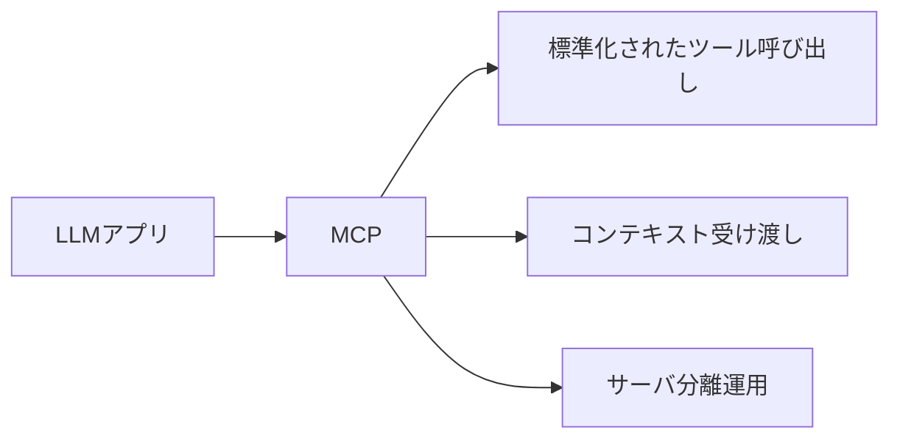
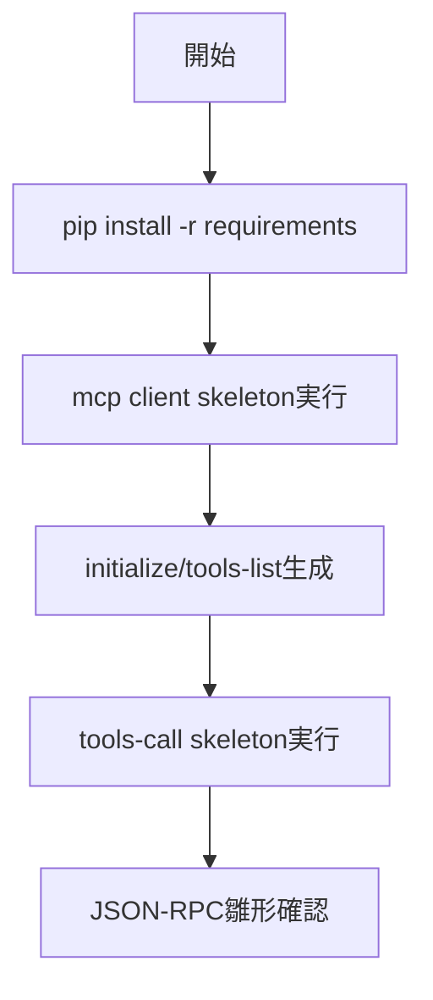

# MCP 入門

> 📖 中級（概念・実践） | 前提: Python基礎 / LLMアプリの基本概念

## この教材で身につくこと

- ツール呼び出しの標準化
- コンテキスト供給の統一
- クライアント/サーバ分離

## コンセプト
MCP（Model Context Protocol）は、LLM と外部ツールを標準化された方法で接続するためのプロトコルです。

**仕様**: MCP 1.0 / OSS仕様（2026-05時点）  
**公式ドキュメント**: https://modelcontextprotocol.io/

## 仕組み

1. クライアントが `initialize` で能力情報を交換します。
2. `tools/list` で利用可能ツールの一覧を取得します。
3. ツール実行時は `tools/call` を JSON-RPC で送信します。
4. サーバは実行結果を標準形式で返却します。
5. クライアントは結果をLLM文脈へ統合して応答生成に利用します。

## 位置づけ



## 実行フロー



## 実ソースコード（言語別に記載）
### 01_mcp-python/00_requirements.txt

```txt
python-dotenv==1.0.0
httpx==0.27.0
```

### 01_mcp-python/01_mcp-client-skeleton.py

```python
"""MCP client skeleton.

このサンプルは学習用の最小構成です。
実運用では使用するMCPサーバ仕様に合わせてJSON-RPCメッセージを拡張してください。
"""

import json
import uuid


def build_initialize_request() -> dict:
	return {
		"jsonrpc": "2.0",
		"id": str(uuid.uuid4()),
		"method": "initialize",
		"params": {
			"clientInfo": {"name": "tutorial-client", "version": "1.0.0"},
			"capabilities": {},
		},
	}


def build_tools_list_request() -> dict:
	return {
		"jsonrpc": "2.0",
		"id": str(uuid.uuid4()),
		"method": "tools/list",
		"params": {},
	}


def main() -> None:
	init_req = build_initialize_request()
	tools_req = build_tools_list_request()

	print("Initialize request:")
	print(json.dumps(init_req, ensure_ascii=False, indent=2))

	print("\nTools/list request:")
	print(json.dumps(tools_req, ensure_ascii=False, indent=2))


if __name__ == "__main__":
	main()
```

### 01_mcp-python/02_mcp-tool-call-skeleton.py

```python
"""MCP tool call request skeleton."""

import json
import uuid


def build_tool_call_request(name: str, arguments: dict) -> dict:
	return {
		"jsonrpc": "2.0",
		"id": str(uuid.uuid4()),
		"method": "tools/call",
		"params": {
			"name": name,
			"arguments": arguments,
		},
	}


def main() -> None:
	req = build_tool_call_request(
		"query_stock_price",
		{"symbol": "7203", "date": "2026-05-09"},
	)
	print(json.dumps(req, ensure_ascii=False, indent=2))


if __name__ == "__main__":
	main()
```

## サンプル

### 実行例

```bash
python 01_mcp-client-skeleton.py
python 02_mcp-tool-call-skeleton.py
```

### 検証

- `initialize` と `tools/list` の JSON-RPC フィールドが揃っているか確認する
- `tools/call` の name と arguments が対象ツール仕様と一致するか確認する

## 演習課題

1. ``MCP 入門`` を使う想定ユースケースを1つ定義し、入力・出力の例を記録してください。
2. 最小構成で動かし、デフォルトから設定を1つ変えて挙動の差分を確認してください。
3. ``MCP 入門`` を使わない場合の代替手段と比較し、選ぶ基準をまとめてください。


### 解答の目安

1. まず課題の目的を一文で明確化し、入力・出力を対応づけて記述します。
   確認ポイント: 何を変えて何を確認する課題かを第三者が読んで理解できること。
2. 最小構成で一度実行し、設定や条件を1つ変更して差分を比較します。
   確認ポイント: 変更前後の挙動差を具体的に説明できること。
3. 適用条件と代替手段を整理し、選択基準を短くまとめます。
   確認ポイント: なぜその手段を選ぶかを根拠付きで示せること。
## 理解度チェック

1. ``MCP 入門`` の主な役割を1文で説明してください。
2. ``MCP 入門`` を導入する際の最大のメリットと注意点は何ですか？
3. ``MCP 入門`` が向かないユースケースとして、どのようなケースが考えられますか？


### 解説の要点

1. 主な役割は、その技術がどの工程を担い、何を改善するかで説明します。
2. メリットは再現性・拡張性・運用性の観点で整理し、注意点は導入コストや複雑性として示します。
3. 使い分けは要件、実装コスト、運用体制の3観点で判断します。
---

[← 前へ](08-protocols/00-README.md) | [次へ →](08-protocols/02-mcp-servers.md)


