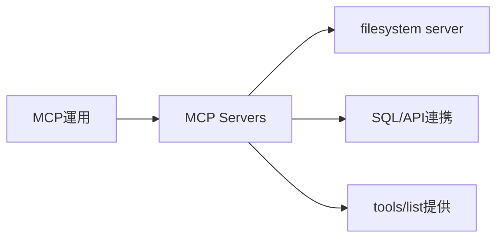
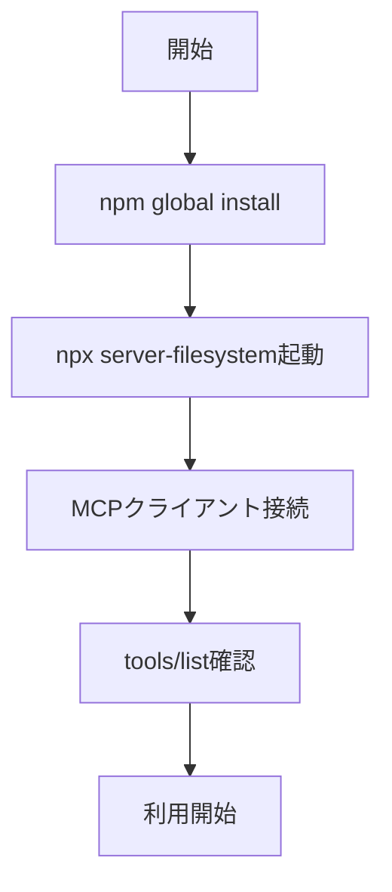

# MCP Servers - ファイル・DB・APIをMCP経由で公開するサーバ実装

> 📖 中級（概念・実践） | 前提: Python基礎 / LLMアプリの基本概念

## この教材で身につくこと

- MCP サーバをローカルで起動し、ツール一覧を取得できる
- filesystem / SQL / HTTP API 向けサーバの違いを説明できる
- `tools/list` と `tools/call` でサーバの機能を呼び出せる
- セキュリティ上のパス制限の仕組みを理解できる

## 概要

**MCP Servers** はファイル、DB、APIなどの機能を MCP 経由で提供する実装群です。

**仕様**: MCP 1.0 対応 / OSS実装群（2026-05時点）  
**公式ドキュメント**: https://modelcontextprotocol.io/

### 仕組み

1. MCPサーバをプロセスとして起動し、ツール群を公開します。
2. クライアントは `tools/list` で利用可能な機能を取得します。
3. 必要な機能を `tools/call` で呼び出して実行します。
4. サーバは実行結果を標準形式で返します。
5. クライアントは結果を会話文脈へ取り込み、次の推論へ渡します。

## 位置づけ

この例では、MCP Servers - ファイル・DB・APIをMCP経由で公開するサーバ実装 の基本的な利用手順を示します。サンプルコードの意図と、実行時に何が起こるのかを確認しながら読み進めると理解しやすくなります。



## 実行フロー



## 最小セットアップ

### 前提条件

- Node.js 18+
- npm

### 例: ローカルファイル向けMCPサーバ

```bash
npm install -g @modelcontextprotocol/server-filesystem
```

### 起動例

```bash
npx @modelcontextprotocol/server-filesystem C:/Dev/stock
```

### 接続確認

MCP対応クライアントから tools/list を実行し、ファイル系ツールが列挙されることを確認します。

## 実ソースコード

### 主要サンプル

この教材の実装例は、本文中の実行手順に対応しています。

### 実行例と検証

```bash
npx @modelcontextprotocol/server-filesystem C:/Dev/stock
```

起動後の確認手順:

- MCP対応クライアントで `tools/list` を実行する
- `read_file` や `write_file` などのツール表示を確認する

検証ポイント:

- 許可したパス配下のみアクセスできるか確認する
- 不正パス指定時にエラーが返ることを確認する

## 演習課題

1. `MCP Servers` を使う想定ユースケースを1つ定義し、入力・出力の例を記録してください。
2. 最小構成で動かし、デフォルトから設定を1つ変えて挙動の差分を確認してください。
3. `MCP Servers` を使わない場合の代替手段と比較し、選ぶ基準をまとめてください。


### 解答の目安

1. まず課題の目的を一文で明確化し、入力・出力を対応づけて記述します。
   確認ポイント: 何を変えて何を確認する課題かを第三者が読んで理解できること。
2. 最小構成で一度実行し、設定や条件を1つ変更して差分を比較します。
   確認ポイント: 変更前後の挙動差を具体的に説明できること。
3. 適用条件と代替手段を整理し、選択基準を短くまとめます。
   確認ポイント: なぜその手段を選ぶかを根拠付きで示せること。

## 理解度チェック

1. MCP Servers の主な役割を1文で説明してください。
2. MCP Servers を導入する際の最大のメリットと注意点は何ですか？
3. MCP Servers が向かないユースケースとして、どのようなケースが考えられますか？


### 解説の要点

1. 主な役割は、その技術がどの工程を担い、何を改善するかで説明します。
2. メリットは再現性・拡張性・運用性の観点で整理し、注意点は導入コストや複雑性として示します。
3. 使い分けは要件、実装コスト、運用体制の3観点で判断します。

## 参考リンク

- [MCP 公式ドキュメント](https://modelcontextprotocol.io/)
- [server-filesystem（GitHub）](https://github.com/modelcontextprotocol/servers/tree/main/src/filesystem)
- [MCP Servers 一覧](https://github.com/modelcontextprotocol/servers)

---

[← 前へ](01-mcp.md) | [次へ →](03-backend-integration.md)
