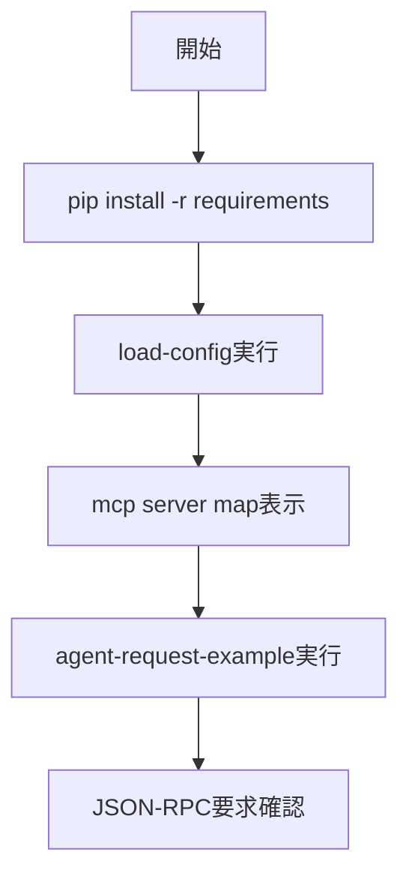

# MCP 実践編: stock-analyzer バックエンド連携

> 📖 中級（概念・実践） | 前提: Python基礎 / LLMアプリの基本概念

## この教材で身につくこと

- 設定ファイルから server 名とコマンドを抽出
- tools/call リクエストをJSON-RPC形式で作成
- yfinance / fetch を想定した呼び出し設計

## コンセプト
この教材は、既存の stock-analyzer の MCP 設定を読み取り、MCP サーバ構成とツール呼び出し要求を組み立てる実践例です。

**仕様**: MCP 1.0 / 実装例（2026-05時点）  
**公式ドキュメント**: https://modelcontextprotocol.io/

## 対象ファイル
- stock-analyzer/backend/mcp_agent.config.yaml
- stock-analyzer/backend/aiagent/mcp_agent.py

## 仕組み

1. 設定ファイルを読み込み、利用するMCPサーバ定義を抽出します。
2. サーバごとの command と args をマップ化します。
3. `initialize` と `tools/list` の要求を作成して接続前提を確認します。
4. 業務ツール向けに `tools/call` 要求を組み立てます。
5. 生成したJSON-RPCをバックエンド実装へ組み込める形で出力します。

## 位置づけ


## 実行フロー



## 実ソースコード（言語別に記載）
### 03_backend-integration-python/00_requirements.txt

```txt
PyYAML==6.0.1
python-dotenv==1.0.0
```

### 03_backend-integration-python/01_load-config.py

```python
"""Load stock-analyzer MCP config and print server map."""

from pathlib import Path
import yaml


def main() -> None:
	config_path = Path("../../../stock-analyzer/backend/mcp_agent.config.yaml")
	if not config_path.exists():
		raise FileNotFoundError(f"Not found: {config_path}")

	data = yaml.safe_load(config_path.read_text(encoding="utf-8"))
	servers = data.get("mcp", {}).get("servers", {})

	print("Detected MCP servers:")
	for name, cfg in servers.items():
		command = cfg.get("command", "")
		args = cfg.get("args", [])
		print(f"- {name}: {command} {' '.join(args)}")


if __name__ == "__main__":
	main()
```

### 03_backend-integration-python/02_agent-request-example.py

```python
"""Build JSON-RPC requests aligned with stock-analyzer MCP setup."""

import json
import uuid


def req(method: str, params: dict) -> dict:
	return {
		"jsonrpc": "2.0",
		"id": str(uuid.uuid4()),
		"method": method,
		"params": params,
	}


def main() -> None:
	initialize = req(
		"initialize",
		{
			"clientInfo": {"name": "stock-tutorial-client", "version": "1.0.0"},
			"capabilities": {},
		},
	)

	list_tools = req("tools/list", {})

	yfinance_call = req(
		"tools/call",
		{
			"name": "yfinance.get_ticker_info",
			"arguments": {"symbol": "7203.T"},
		},
	)

	fetch_call = req(
		"tools/call",
		{
			"name": "fetch.fetch",
			"arguments": {"url": "https://example.com"},
		},
	)

	print("initialize:")
	print(json.dumps(initialize, ensure_ascii=False, indent=2))
	print("\ntools/list:")
	print(json.dumps(list_tools, ensure_ascii=False, indent=2))
	print("\nyfinance tools/call:")
	print(json.dumps(yfinance_call, ensure_ascii=False, indent=2))
	print("\nfetch tools/call:")
	print(json.dumps(fetch_call, ensure_ascii=False, indent=2))


if __name__ == "__main__":
	main()
```

## サンプル

### 実行例

```bash
python 01_load-config.py
python 02_agent-request-example.py
```

### 検証

- サーバ名、command、args が config と一致するか確認する
- `tools/call` の name と arguments が対象ツール仕様に沿うか確認する

## 演習課題

1. ``MCP 実践編: stock`` を使う想定ユースケースを1つ定義し、入力・出力の例を記録してください。
2. 最小構成で動かし、デフォルトから設定を1つ変えて挙動の差分を確認してください。
3. ``MCP 実践編: stock`` を使わない場合の代替手段と比較し、選ぶ基準をまとめてください。


### 解答の目安

1. まず課題の目的を一文で明確化し、入力・出力を対応づけて記述します。
   確認ポイント: 何を変えて何を確認する課題かを第三者が読んで理解できること。
2. 最小構成で一度実行し、設定や条件を1つ変更して差分を比較します。
   確認ポイント: 変更前後の挙動差を具体的に説明できること。
3. 適用条件と代替手段を整理し、選択基準を短くまとめます。
   確認ポイント: なぜその手段を選ぶかを根拠付きで示せること。

## 理解度チェック

1. ``MCP 実践編: stock`` の主な役割を1文で説明してください。
2. ``MCP 実践編: stock`` を導入する際の最大のメリットと注意点は何ですか？
3. ``MCP 実践編: stock`` が向かないユースケースとして、どのようなケースが考えられますか？


### 解説の要点

1. 主な役割は、その技術がどの工程を担い、何を改善するかで説明します。
2. メリットは再現性・拡張性・運用性の観点で整理し、注意点は導入コストや複雑性として示します。
3. 使い分けは要件、実装コスト、運用体制の3観点で判断します。
---

[← 前へ](08-protocols/02-mcp-servers.md) | [次へ →](09-code-generation/00-README.md)


