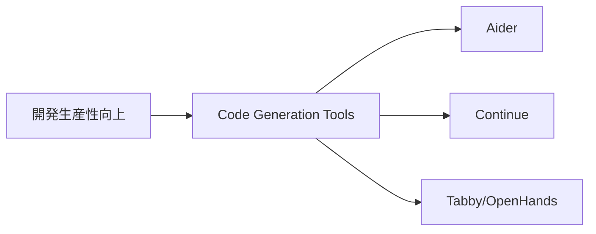
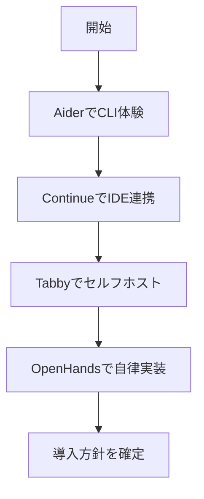

# コード生成・開発支援

> 🔰 初級（カテゴリ導入） | 前提: -

コード生成、編集支援、IDE統合のOSSを学ぶ教材です。

## 位置づけ

## 学習フロー

## 含まれるOSS
- Aider
- Continue
- Tabby
- OpenHands

## 教材リンク

- [01-aider.md](./01-aider.md)
- [02-continue.md](./02-continue.md)
- [03-tabby.md](./03-tabby.md)
- [04-openhands.md](./04-openhands.md)

## 学習順序
1. Aider（CLIで最速体験）
2. Continue（IDE連携）
3. Tabby（セルフホスト補完）
4. OpenHands（自律実装エージェント）

## 完了条件

- カテゴリ内の主要OSSを3つ以上説明できる
- 最小サンプルを1件以上動作確認できる
- 選定観点（速度/運用性/拡張性）で比較メモを作成できる

---

[← 前へ](08-protocols/03-backend-integration.md) | [次へ →](09-code-generation/01-aider.md)

