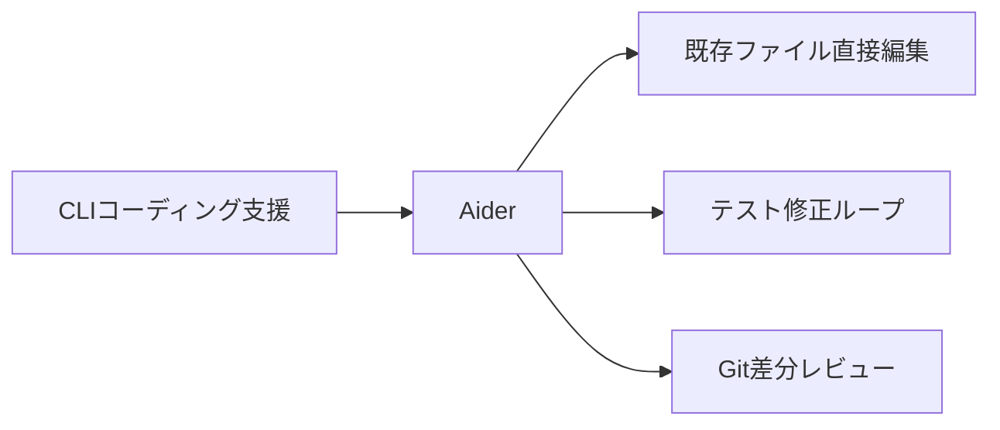
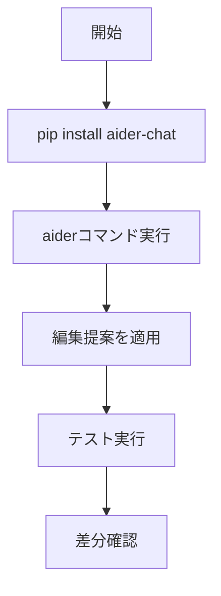

# Aider 入門

> 📖 中級（概念・実践） | 前提: Python基礎 / LLMアプリの基本概念

## この教材で身につくこと

- 複数ファイル編集
- テスト実行と修正ループ
- Git差分を意識した変更

## コンセプト
Aider は、既存リポジトリを対象に CLI で対話しながら差分編集を進めるツールです。起動時に編集対象を絞り、短い指示を繰り返すことで安全に変更を積み上げます。

**バージョン**: 最新版 / OSS準拠（2026-05時点）  
**公式ドキュメント**: https://aider.chat/

## 仕組み

1. 起動時に対象ファイルを読み込み、編集範囲を固定します。
2. 対話で入力した指示を解釈し、変更候補を差分として生成します。
3. 必要なファイルを横断して編集し、整合性を取ります。
4. テスト結果やエラー内容を取り込み、追加修正を提案します。
5. 最終的に `git diff` で確認しやすい形で変更を残します。

## 位置づけ



## 実行フロー



## 最小セットアップ

### インストール

```bash
pip install aider-chat
```

### 実行例

```bash
aider --model gpt-4o-mini src/main.py tests/test_main.py
```

起動後の指示例:

- src/main.py に入力値チェックを追加して
- 不正入力時のテストを tests/test_main.py に追加して
- 変更理由を3行で要約して

### 検証

```bash
pytest -q
git diff
```

## 使い方のコツ

- 変更対象ファイルを明示して開始
- 小さく依頼してテストを都度実行

## サンプル

1. `aider --model gpt-4o-mini src/main.py tests/test_main.py` で起動する。
2. 入力バリデーション追加の指示を出す。
3. 生成差分を確認して適用する。
4. `pytest -q` を実行し、失敗時は追加指示で再修正する。
5. `git diff` で最終差分を確認する。


## 実ソースコード（言語別に記載）

### 主要サンプル
- この教材の実装例は、本文中の実行手順に対応しています。
- 必要に応じて、主要コードの抜粋をこのセクションへ追記してください。

## 演習課題

1. ``Aider 入門`` を使う想定ユースケースを1つ定義し、入力・出力の例を記録してください。
2. 最小構成で動かし、デフォルトから設定を1つ変えて挙動の差分を確認してください。
3. ``Aider 入門`` を使わない場合の代替手段と比較し、選ぶ基準をまとめてください。


### 解答の目安

1. まず課題の目的を一文で明確化し、入力・出力を対応づけて記述します。
   確認ポイント: 何を変えて何を確認する課題かを第三者が読んで理解できること。
2. 最小構成で一度実行し、設定や条件を1つ変更して差分を比較します。
   確認ポイント: 変更前後の挙動差を具体的に説明できること。
3. 適用条件と代替手段を整理し、選択基準を短くまとめます。
   確認ポイント: なぜその手段を選ぶかを根拠付きで示せること。

## 理解度チェック

1. ``Aider 入門`` の主な役割を1文で説明してください。
2. ``Aider 入門`` を導入する際の最大のメリットと注意点は何ですか？
3. ``Aider 入門`` が向かないユースケースとして、どのようなケースが考えられますか？


### 解説の要点

1. 主な役割は、その技術がどの工程を担い、何を改善するかで説明します。
2. メリットは再現性・拡張性・運用性の観点で整理し、注意点は導入コストや複雑性として示します。
3. 使い分けは要件、実装コスト、運用体制の3観点で判断します。
---

[← 前へ](09-code-generation/00-README.md) | [次へ →](09-code-generation/02-continue.md)


