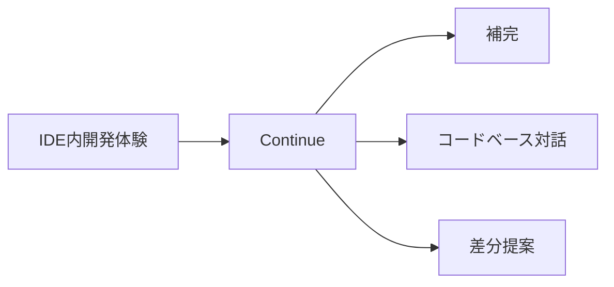
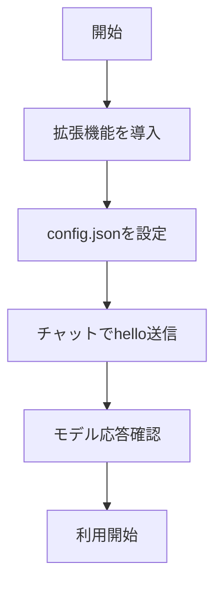

# Continue - IDEに統合された補完・対話編集アシスタント

> 📖 中級（概念・実践） | 前提: Python基礎 / LLMアプリの基本概念

## この教材で身につくこと

- IDEからコード補完を利用できる
- リポジトリ全体を文脈としたチャット編集ができる
- 差分提案を確認・適用する運用フローを回せる

## 概要

Continue は VS Code/JetBrains 上で補完と対話編集を一体化する OSS アシスタントです。エディタ内でコード文脈を参照しながら、小さな変更を反復する運用に向きます。

**バージョン**: 最新版 / OSS準拠（2026-05時点）  
**公式ドキュメント**: https://www.continue.dev/

仕組みの概要:

1. IDE拡張として起動し、開いているワークスペース文脈を参照します。
2. チャット指示を解析し、関連ファイル候補を探索します。
3. 変更提案を差分として提示し、ユーザーが適用可否を判断します。
4. 補完と対話を往復し、局所修正を短いサイクルで進めます。
5. 最後にテストや実行で意図どおりかを確認します。

## 位置づけ



## 実行フロー



## 最小セットアップ

### 1. 拡張機能をインストール

- VS Code Marketplace で Continue を導入

### 2. 設定ファイル

- config.json に以下の内容を反映

```json
{
	"models": [
		{
			"title": "Local OpenAI Compatible",
			"provider": "openai",
			"model": "gpt-4o-mini",
			"apiBase": "http://localhost:11434/v1",
			"apiKey": "dummy"
		}
	],
	"tabAutocompleteModel": {
		"title": "Local OpenAI Compatible",
		"provider": "openai",
		"model": "gpt-4o-mini",
		"apiBase": "http://localhost:11434/v1",
		"apiKey": "dummy"
	}
}
```

### 3. 接続確認

- チャットで hello を送ってモデル応答を確認

## 実ソースコード

### 操作例

1. Continue パネルを開く。
2. 次の指示を送る: `src/api/client.ts のエラーハンドリングを共通化して`。
3. 提示された差分を確認して適用する。
4. 続けて次の指示を送る: `関連テストも最小修正して`。

### 検証

- 差分に不要変更が混ざっていないか確認する。
- プロジェクトのテストコマンドを実行して回帰を確認する。
- 失敗時はエラーログを貼って追加修正を依頼する。

## 演習課題

1. Continue を使う想定ユースケースを1つ定義し、入力・出力の例を記録してください。
2. 最小構成で動かし、デフォルトから設定を1つ変えて挙動の差分を確認してください。
3. Continue を使わない場合の代替手段と比較し、選ぶ基準をまとめてください。

### 解答の目安

1. まず課題の目的を一文で明確化し、入力・出力を対応づけて記述します。
   確認ポイント: 何を変えて何を確認する課題かを第三者が読んで理解できること。
2. 最小構成で一度実行し、設定や条件を1つ変更して差分を比較します。
   確認ポイント: 変更前後の挙動差を具体的に説明できること。
3. 適用条件と代替手段を整理し、選択基準を短くまとめます。
   確認ポイント: なぜその手段を選ぶかを根拠付きで示せること。

## 理解度チェック

1. Continue の主な役割を1文で説明してください。
2. Continue を導入する際の最大のメリットと注意点は何ですか？
3. Continue が向かないユースケースとして、どのようなケースが考えられますか？

### 解説の要点

1. 主な役割は、その技術がどの工程を担い、何を改善するかで説明します。
2. メリットは再現性・拡張性・運用性の観点で整理し、注意点は導入コストや複雑性として示します。
3. 使い分けは要件、実装コスト、運用体制の3観点で判断します。

---

[← 前へ](01-aider.md) | [次へ →](03-tabby.md)
