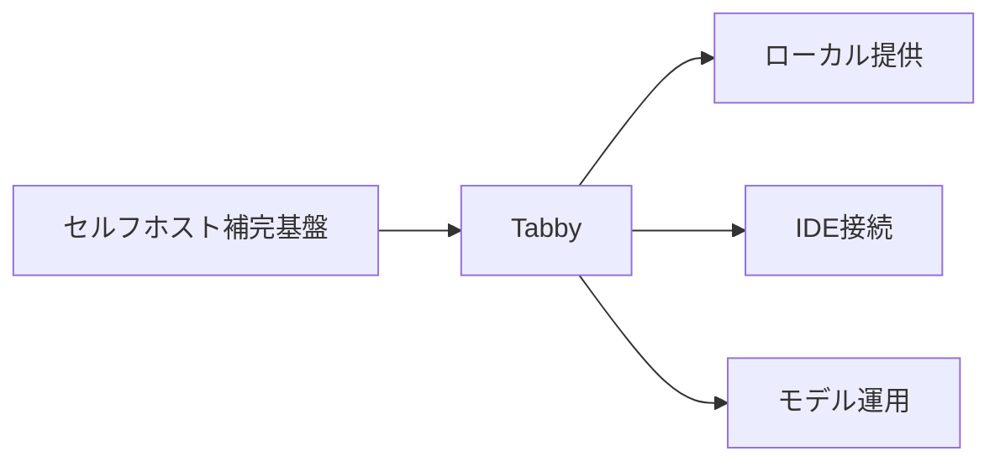
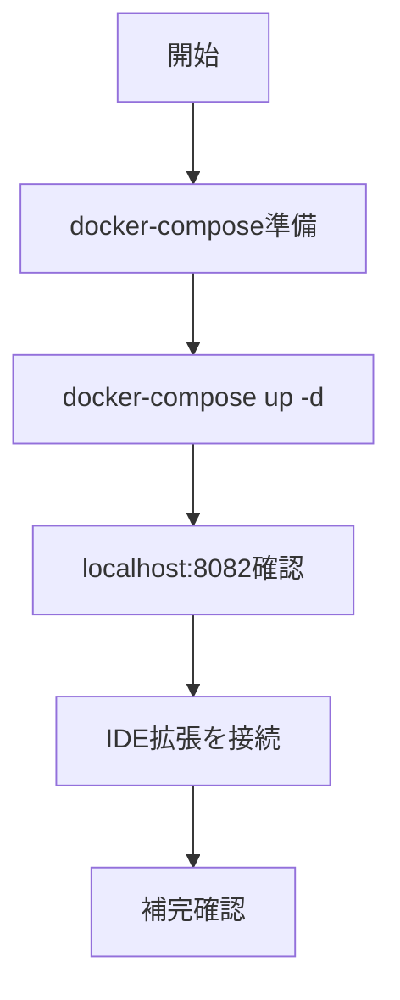

# Tabby - セルフホスト型コード補完基盤

> 📖 中級（概念・実践） | 前提: Python基礎 / LLMアプリの基本概念

## この教材で身につくこと

- ローカル・社内環境でコード補完サーバを構築できる
- IDEとTabbyサーバを接続して補完を利用できる
- モデル設定とリソースを自組織で管理できる

## 概要

Tabby は、ローカルまたは社内環境で運用できるセルフホスト型のコード補完基盤です。外部SaaSに依存せず、補完品質と運用ポリシーを自組織で管理したい場面に適しています。

**バージョン**: 最新版 / OSS準拠（2026-05時点）  
**公式ドキュメント**: https://tabby.tabbyml.com/

仕組みの概要:

1. サーバ側でモデルを起動し、補完APIを提供します。
2. IDE拡張がTabbyサーバへ補完リクエストを送信します。
3. サーバが文脈を使って候補を生成し、IDEへ返します。
4. 利用ログと負荷を見ながらモデルとリソースを調整します。
5. 運用時はアクセス制御やバージョン更新を継続的に管理します。

## 位置づけ



## 実行フロー



## 最小セットアップ

### 構成例

```yaml
version: "3.8"

services:
	tabby:
		image: tabbyml/tabby:latest
		container_name: tabby
		ports:
			- "8082:8080"
		command: ["serve", "--model", "TabbyML/StarCoder-1B"]
		restart: unless-stopped
```

### 起動

```bash
docker-compose up -d
```

### 接続

- URL: http://localhost:8082
- IDE側で Tabby 拡張を使って接続

## 実ソースコード

### 実行例

```bash
docker-compose up -d
```

IDE側の指示例:

- Python ファイルで関数シグネチャを入力し、補完候補を確認する
- 補完が弱い場合はモデル設定を見直して再起動する

### 検証

```bash
docker ps
docker logs tabby --tail 50
```

## 演習課題

1. Tabby を使う想定ユースケースを1つ定義し、入力・出力の例を記録してください。
2. 最小構成で動かし、デフォルトから設定を1つ変えて挙動の差分を確認してください。
3. Tabby を使わない場合の代替手段と比較し、選ぶ基準をまとめてください。

### 解答の目安

1. まず課題の目的を一文で明確化し、入力・出力を対応づけて記述します。
   確認ポイント: 何を変えて何を確認する課題かを第三者が読んで理解できること。
2. 最小構成で一度実行し、設定や条件を1つ変更して差分を比較します。
   確認ポイント: 変更前後の挙動差を具体的に説明できること。
3. 適用条件と代替手段を整理し、選択基準を短くまとめます。
   確認ポイント: なぜその手段を選ぶかを根拠付きで示せること。

## 理解度チェック

1. Tabby の主な役割を1文で説明してください。
2. Tabby を導入する際の最大のメリットと注意点は何ですか？
3. Tabby が向かないユースケースとして、どのようなケースが考えられますか？

### 解説の要点

1. 主な役割は、その技術がどの工程を担い、何を改善するかで説明します。
2. メリットは再現性・拡張性・運用性の観点で整理し、注意点は導入コストや複雑性として示します。
3. 使い分けは要件、実装コスト、運用体制の3観点で判断します。

---

[← 前へ](02-continue.md) | [次へ →](04-openhands.md)
