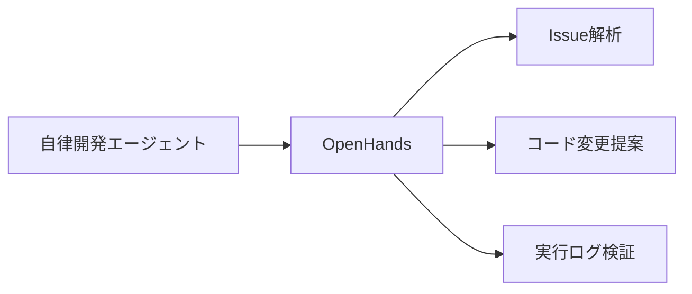
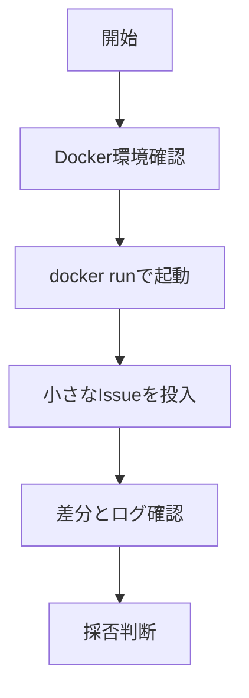

# OpenHands 入門

> 📖 中級（概念・実践） | 前提: Python基礎 / LLMアプリの基本概念

## この教材で身につくこと

- タスク解析
- コード編集提案
- 実行ログ付きで検証

## コンセプト
OpenHands は、Issue 形式の要件を入力として実装作業を自律実行する開発エージェントです。調査、編集、実行、ログ確認までを連結し、試作速度を上げることを狙います。

**バージョン**: 最新版 / OSS準拠（2026-05時点）  
**公式ドキュメント**: https://github.com/All-Hands-AI/OpenHands

## 仕組み

1. 入力Issueを解析し、実行計画を作成します。
2. 必要なファイルを探索して変更案を生成します。
3. コード編集後にコマンド実行で結果を検証します。
4. 失敗時はログを参照して再試行します。
5. 最終的に差分と実行ログをまとめて提示します。

## 位置づけ



## 実行フロー



## 最小セットアップ

### 前提条件

- Docker
- OpenAI 互換APIキー

### 起動イメージ

```bash
docker run -it --rm \
  -e OPENAI_API_KEY=your-key \
  allhandsai/openhands:latest
```

### 学習の進め方

1. 小さなIssueを入力
2. 生成差分を確認
3. テストを実行して採否を判断

## サンプル

### 起動

```bash
docker run -it --rm \
	-e OPENAI_API_KEY=your-key \
	allhandsai/openhands:latest
```

### Issue指示例

- docs/README の誤字を修正して
- src/utils/date.py の重複処理を関数化して
- 変更後にテスト結果を添えて

### 検証

```bash
git diff
pytest -q
```


## 実ソースコード（言語別に記載）

### 主要サンプル
- この教材の実装例は、本文中の実行手順に対応しています。
- 必要に応じて、主要コードの抜粋をこのセクションへ追記してください。

## 演習課題

1. ``OpenHands 入門`` を使う想定ユースケースを1つ定義し、入力・出力の例を記録してください。
2. 最小構成で動かし、デフォルトから設定を1つ変えて挙動の差分を確認してください。
3. ``OpenHands 入門`` を使わない場合の代替手段と比較し、選ぶ基準をまとめてください。


### 解答の目安

1. まず課題の目的を一文で明確化し、入力・出力を対応づけて記述します。
   確認ポイント: 何を変えて何を確認する課題かを第三者が読んで理解できること。
2. 最小構成で一度実行し、設定や条件を1つ変更して差分を比較します。
   確認ポイント: 変更前後の挙動差を具体的に説明できること。
3. 適用条件と代替手段を整理し、選択基準を短くまとめます。
   確認ポイント: なぜその手段を選ぶかを根拠付きで示せること。
## 理解度チェック

1. ``OpenHands 入門`` の主な役割を1文で説明してください。
2. ``OpenHands 入門`` を導入する際の最大のメリットと注意点は何ですか？
3. ``OpenHands 入門`` が向かないユースケースとして、どのようなケースが考えられますか？


### 解説の要点

1. 主な役割は、その技術がどの工程を担い、何を改善するかで説明します。
2. メリットは再現性・拡張性・運用性の観点で整理し、注意点は導入コストや複雑性として示します。
3. 使い分けは要件、実装コスト、運用体制の3観点で判断します。
---

[← 前へ](09-code-generation/03-tabby.md)


