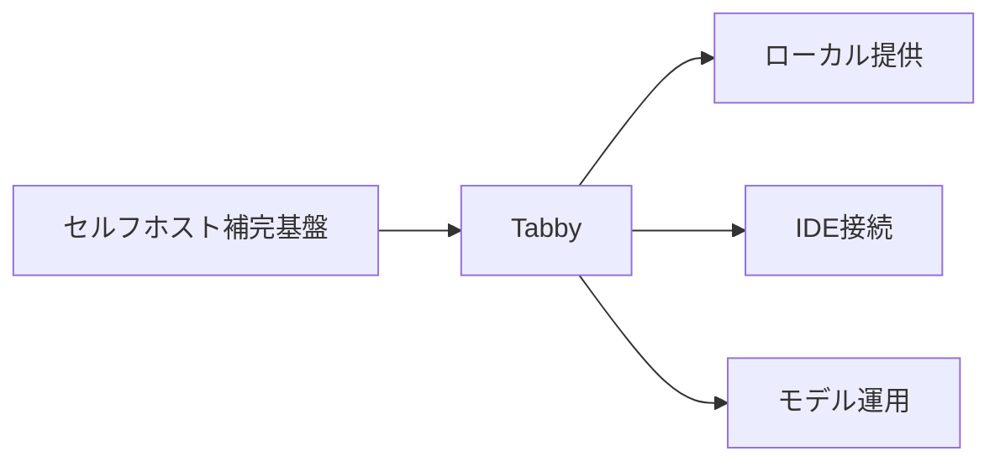
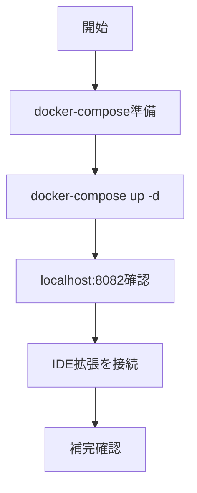

# Tabby 入門

> 📖 中級（概念・実践） | 前提: Python基礎 / LLMアプリの基本概念

## この教材で身につくこと

- ローカル/社内補完
- IDEとの接続
- モデル管理

## 概要
Tabby はセルフホスト型のコード補完サーバです。社内環境で補完基盤を持ちたいときに有効です。

## 詳細
- ローカル/社内補完
- IDEとの接続
- モデル管理

## 位置づけ



## 実行フロー



## 最小セットアップ

### 構成例

```yaml
version: "3.8"

services:
	tabby:
		image: tabbyml/tabby:latest
		container_name: tabby
		ports:
			- "8082:8080"
		command: ["serve", "--model", "TabbyML/StarCoder-1B"]
		restart: unless-stopped
```

### 起動

```bash
docker-compose up -d
```

### 接続

- URL: http://localhost:8082
- IDE側で Tabby 拡張を使って接続


## 実ソースコード（言語別に記載）

### 主要サンプル
- この教材の実装例は、本文中の実行手順に対応しています。
- 必要に応じて、主要コードの抜粋をこのセクションへ追記してください。

## 演習課題

1. ``Tabby 入門`` を使う想定ユースケースを1つ定義し、入力・出力の例を記録してください。
2. 最小構成で動かし、デフォルトから設定を1つ変えて挙動の差分を確認してください。
3. ``Tabby 入門`` を使わない場合の代替手段と比較し、選ぶ基準をまとめてください。


### 解答の目安

1. まず課題の目的を一文で明確化し、入力・出力を対応づけて記述します。
   確認ポイント: 何を変えて何を確認する課題かを第三者が読んで理解できること。
2. 最小構成で一度実行し、設定や条件を1つ変更して差分を比較します。
   確認ポイント: 変更前後の挙動差を具体的に説明できること。
3. 適用条件と代替手段を整理し、選択基準を短くまとめます。
   確認ポイント: なぜその手段を選ぶかを根拠付きで示せること。
## 理解度チェック

1. ``Tabby 入門`` の主な役割を1文で説明してください。
2. ``Tabby 入門`` を導入する際の最大のメリットと注意点は何ですか？
3. ``Tabby 入門`` が向かないユースケースとして、どのようなケースが考えられますか？


### 解説の要点

1. 主な役割は、その技術がどの工程を担い、何を改善するかで説明します。
2. メリットは再現性・拡張性・運用性の観点で整理し、注意点は導入コストや複雑性として示します。
3. 使い分けは要件、実装コスト、運用体制の3観点で判断します。
---

[← 前へ](09_code-generation/02_continue.md) | [次へ →](09_code-generation/04_openhands.md)


